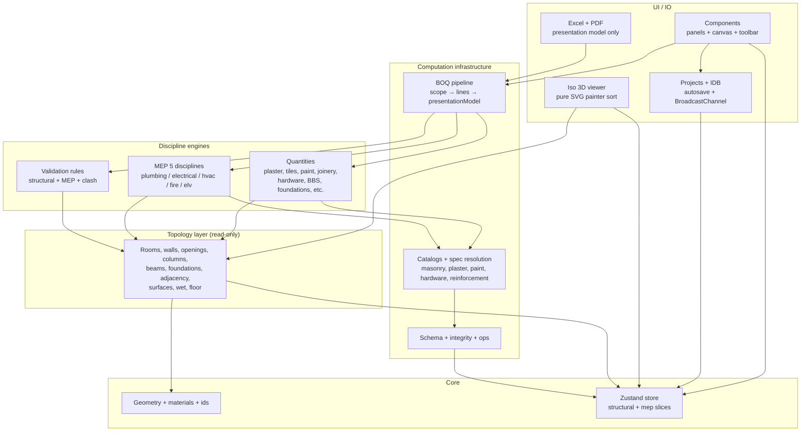
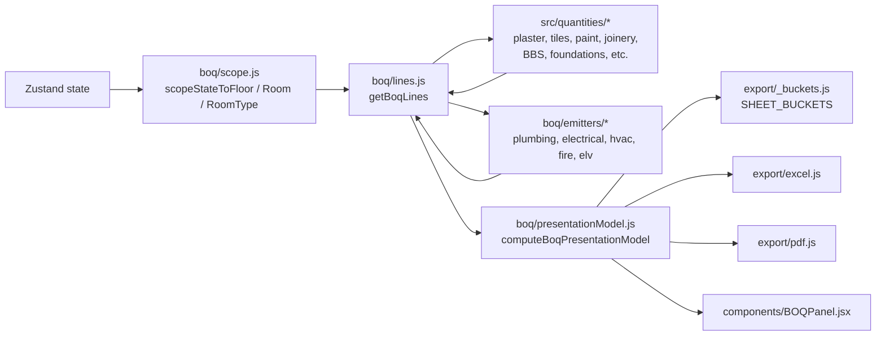
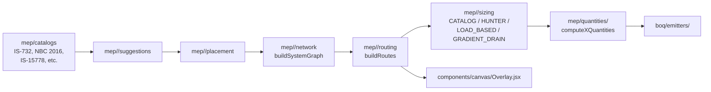
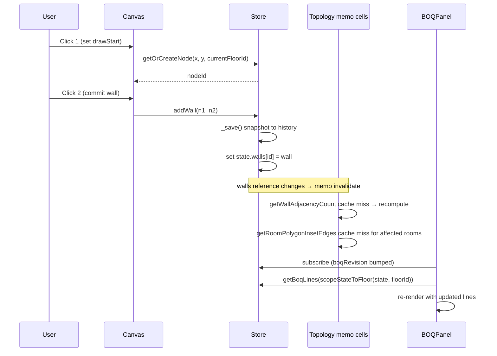
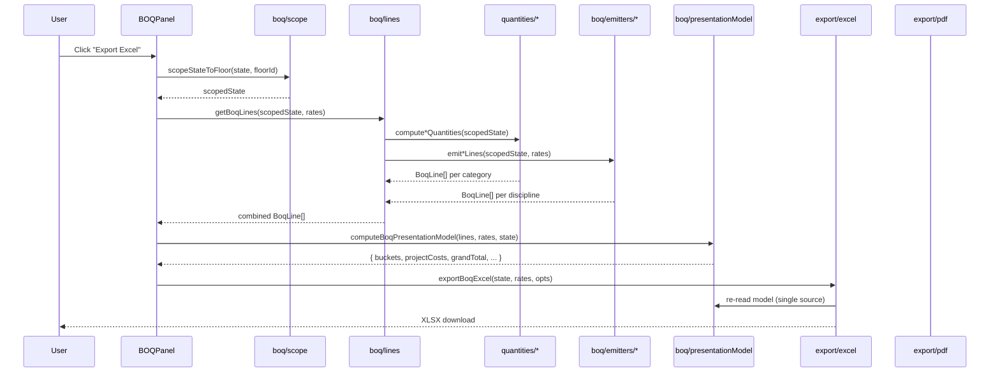
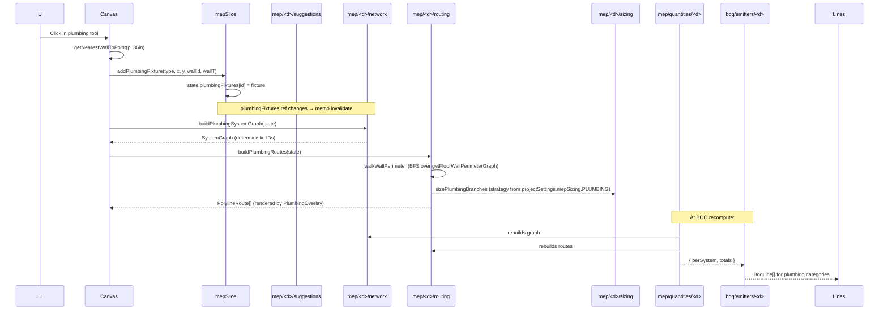
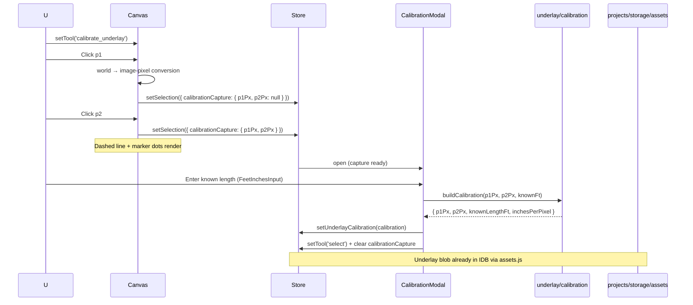

# Codebase Map

> Auto-generated by Cartographer. Last mapped: 2026-05-27.
> **Read me first**, then jump to the relevant Module Guide. Rule reference (the canonical "do / don't" doc) lives in `CLAUDE.md` — this map points to it; it does not duplicate it.

---

## What this app is

A Vite + React 19 + Zustand 5 client-side editor that takes a residential floor plan, computes the structural / civil / MEP Bill of Quantities to Indian construction standards (IS 732, IS 15778, IS 13592, NBC 2016, IS 2065, ISHRAE, MNRE), and exports procurement-ready PDF + Excel. Greenfield project — no migrations, no backend, IDB-canonical persistence with multi-tab sync. ~319 source files (~586k tokens) across 40 directories under `src/` and 27 verify scripts under `scripts/`.

---

## System Overview

The codebase is five concentric layers. Inner layers are pure / framework-free. Outer layers (UI, persistence, export) consume the inner layers and never the other way round.



### The BOQ pipeline (single canonical path)



**Rule (locked):** Excel and PDF never recompute amounts. `model.grandTotal === Excel.grandTotal === PDF.grandTotal` is enforced by verify-boq.

### The MEP pipeline (mirrored across 5 disciplines)



Five disciplines: **plumbing, electrical, hvac, fire, elv**. Solar and Rainwater are schema-only (Phase 2.3 / 2.4 deferred — stubs in `boq/scope.js`).

---

## Directory Structure

```
src/
├── App.jsx, main.jsx       # entry + persistence boot + autosave install
├── store.js                # primary Zustand store (root + UI state + history)
├── structuralSlice.js      # structural entities + projectSettings + most actions
├── mepSlice.js             # 7 MEP collections + applyRoomMepDefaults
├── geometry.js             # pure coord math (w2s, snap, point-in-polygon, doRoomsOverlap)
├── materials.js            # MATERIAL_LIBRARY (wall masonry), BONDING enum
├── formulas.js             # UI explainer dispatch (re-exports formulas/)
├── roomPresets.js          # ROOM_PRESETS + per-type finish flags
│
├── lib/                    # 4 leaf utilities
│   ├── ids.js              # ★ only home of crypto.randomUUID() — uid/uidIfc/newEntityIds
│   ├── numbers.js          # ★ only home of safeR2/safeRound/safeNum/safeClamp
│   ├── units.js            # feet-inches formatter + parser + unit-mode aware formatting
│   └── columnShapes.js     # shape-polymorphic column section math
│
├── constants/              # 5 frozen registries (single sources of truth)
│   ├── boqCategories.js    # BOQ_CATEGORIES, BOQ_LINE_ID, BOQ_SCOPE, scopeSupport defaults
│   ├── units.js            # UNITS (NOS, RFT, SFT, CFT, KG, BAG)
│   ├── structural.js       # BEAM_LEVEL_REGISTRY, PCC_BEDDING_THICKNESS_FT, mix constants
│   ├── joinery.js          # OPENING_SUBTYPE, SUBTYPE_SOURCE, ventilator thresholds
│   └── layers.js           # DEFAULT_LAYER_VISIBILITY (40+ keys)
│
├── design/tokens.css       # ★ single design-token file (colors / spacing / shadow / z-index)
│
├── schema/                 # entity contracts + normalization + integrity
│   ├── types.js            # FIELD_TYPES enum
│   ├── entities/*          # 17 schema files (one per entity type) + index barrel
│   ├── normalize.js        # default-injection + legacy alias rewriting
│   ├── validate.js         # type + invariant validation
│   └── integrity.js        # ★ FK walk — single FK authority via FK_DESCRIPTORS
│
├── store/
│   └── legacyAccessors.js  # 5-namespace slice classification + SHIM_KILL_BY date
│
├── operations/             # journal-based ops dispatch (coexists with legacy _save)
│   ├── types.js            # OP_KIND (USER/SYSTEM/TRANSIENT) + buildOp + withInverse
│   ├── registry.js         # 13 representative ops + apply() pure functions
│   ├── dispatch.js         # dispatch + transaction; routes by kind
│   ├── _schemaVersion.js   # SCHEMA_VERSION = 8 (single source)
│   └── index.js            # barrel
│
├── topology/               # ★ read-only spatial-relationship layer (12 files)
│   ├── cache.js            # createMemo() — reference-equality memoizer
│   ├── rooms.js            # ★ getRoomGeometry (single entry point), insetEdges, dimension mode
│   ├── floor.js            # floor-scoped entity selectors
│   ├── walls.js            # adjacency + external/partition classification
│   ├── openings.js         # opening selectors + subtype heuristic
│   ├── columns.js          # node↔column index + floor spans
│   ├── beams.js            # WALL_DERIVED beams + resolveBeamEndpoint
│   ├── foundations.js      # foundation as attachment authority
│   ├── adjacency.js        # room graphs + getFloorWallPerimeterGraph (MEP routing BFS)
│   ├── surfaces.js         # faceA/faceB ownership per wall
│   ├── wet.js              # WET_ROOM_TYPES + wet-wall sets
│   └── index.js            # barrel
│
├── quantities/             # pure aggregators — material rollups
│   ├── _metaContract.js    # _meta envelope (algorithm/version/attribution/scoped)
│   ├── plaster.js          # ★ ROOM_FACE_ACCUMULATION_V2 (two-pass model)
│   ├── tiles.js, paint.js, ceilingFinish.js
│   ├── joinery.js, doorHardware.js, grills.js
│   ├── bbs.js              # BBS + grouped-by-spec + excludeIds for estimate fallback
│   ├── foundations.js, shuttering.js, excavation.js
│
├── boq/                    # BOQ assembly pipeline
│   ├── scope.js            # ★ scopeStateToFloor/Room/RoomType — filters only
│   ├── lines.js            # ★ getBoqLines (canonical pipeline entry)
│   ├── presentationModel.js # ★ computeBoqPresentationModel (Excel + PDF consumer)
│   ├── projectCosts.js     # labor + supervision + overhead + GST rollup
│   ├── _scopeOfWork.js     # auto-stats for cover sheet
│   ├── _contingencyResolver.js # per-line contingency % lookup
│   └── emitters/
│       ├── plumbing.js, electrical.js, hvac.js, fire.js, elv.js
│
├── specs/                  # versioned catalogs + spec resolution
│   ├── resolution.js       # ★ reinforcement spec fallback chain (single home)
│   ├── reinforcementSpecs.js # BBS presets + per-element compute (Steel constants, hooks, laps)
│   ├── masonrySystems.js, plasterSystems.js
│   ├── paintSystems.js, ceilingFinishSystems.js
│   ├── catalogManifest.js  # getAllCatalogVersions + diffCatalogManifests (drift detection)
│   └── hardware/
│       ├── hardwareItems.js, hardwareSets.js
│       └── resolution.js   # ★ opening hardware fallback chain
│
├── formulas/               # UI BOQ-explainer functions (re-export barrel)
│   └── columnFootingBeamFormulas.js, slabStaircaseFormulas.js,
│      steelConcreteFormulas.js, masonryDeductionFormulas.js, structuralFormulas.js
│
├── compute/                # DAG registry (Phase 3 infrastructure)
│   ├── registry.js         # defineComputation + runComputation + COMPUTE_CLASS
│   ├── profile.js          # opt-in timing instrumentation
│   └── index.js
│
├── validation/             # rules engine (Phase 3)
│   ├── registry.js         # VALIDATION_SCOPE enum + buildIssueKey + dismissal helpers
│   ├── engine.js           # runValidation (scoped + dismissal-aware)
│   └── rules/              # 5 structural rules (floatingColumn, slabNoEnclosure, etc.)
│
├── iso/                    # 3D iso viewer (pure, no React)
│   ├── projection.js       # makeViewBasis + worldToIso + floorBaseZIn
│   ├── viewPresets.js      # ISO_PRESETS + TOP_PRESET + DEFAULT_VIEW
│   ├── extrude.js          # Solid → Face[] with painter sort
│   ├── solids.js           # resolveWall/Column/Foundation/Stamp Solid
│   ├── sort.js             # back-to-front comparator with stable tiebreaks
│   └── colors.js           # palette + per-face shading
│
├── export/                 # PDF + Excel + bucket registry
│   ├── _buckets.js         # ★ SHEET_BUCKETS (single source for category → sheet/section)
│   ├── excel.js            # exportBoqExcel (live formulas, no math)
│   └── pdf.js              # exportBoqPdf (cover + sections + summary)
│
├── mep/                    # full discipline stack — see "Module Guide → MEP"
│   ├── catalogs/           # 26 versioned catalog files (IS/NBC/ISHRAE/MNRE sources)
│   ├── shared/             # systemGraph, routingZones, sizingStrategy, clashDetection,
│   │                       # fittingCounter, geometry, risers, suggestions, ifcMapping
│   ├── plumbing/           # 8 files: network/routing/sizing/suggestions/fixturePlacement/drainage/hotwater
│   ├── electrical/         # 9 files: + circuitGrouping, dbPlacement, pointPlacement, submains
│   ├── hvac/, fire/, elv/  # 6 files each
│   ├── quantities/         # 5 per-discipline aggregators
│   ├── validation/         # 3 MEP rules + barrel
│   └── resolution.js       # ★ MEP per-instance override resolver (single home)
│
├── projects/               # IDB-canonical persistence
│   ├── _snapshot.js        # ★ buildSnapshot (model-only contract; reused by autosave + revisions + verify)
│   ├── autosave.js         # 30s debounce; subscribe + beforeunload flush
│   ├── manager.js          # public sync API + write queue + BroadcastChannel + cache
│   ├── templates.js        # ★ MODEL-ONLY snapshot + FK rewrite via FK_DESCRIPTORS
│   ├── schemaVersion.js    # MIGRATIONS chain + runMigrations
│   └── storage/
│       ├── indexedDb.js    # createPersistence facade + makeMemoryAdapter
│       ├── idbAdapter.js   # real browser IDB adapter; DB_VERSION = 3
│       ├── assets.js       # generic binary asset primitive
│       └── getAssetStorage.js # lazy singleton (IDB in browser, memory in Node)
│
├── revisions/              # localStorage ring buffer of named revisions
│   ├── manager.js          # listRevisions + createRevision (cached, useSyncExternalStore-safe)
│   ├── snapshot.js         # buildRevisionSnapshot (snapshot + boqSummary + validationSummary)
│   └── diff.js             # pure-function entity/BOQ/validation diff
│
├── underlay/               # PDF/image underlay + calibration
│   ├── calibration.js      # ★ all math in image-pixel space (not world coords)
│   └── pdfRender.js        # dynamic pdfjs-dist import (chunk-split)
│
├── hooks/
│   ├── useKeyboardShortcuts.js # global keydown handler + boq:toggle + toolbar:close-dropdowns
│   └── useUnits.js         # stable-ref unit helpers
│
└── components/             # 39 root + 12 ui + 6 canvas + 18 boq sections
    ├── ui/                 # tokenized primitives
    │   ├── Button, Panel, SelectionPanel, Modal,
    │   ├── Dialog (+ DialogHost), Toast (+ ToastHost),
    │   ├── Field, Dropdown (+ Group/Item/Toggle/Segmented),
    │   ├── FeetInchesInput, InchesInput
    │   └── ui.css, Dropdown.css
    ├── canvas/             # 5 discipline overlays + ClashOverlay
    └── boq/                # 17 purely-presentational section components + BoqRow primitives

scripts/                    # 27 verify scripts + resolver-hook
```

---

## Module Guide

### 1. Core state (`store.js` + slices + operations + schema)

**Purpose**: owns the Zustand state, mutation actions, history, and the entity-schema + integrity verifier contracts on which every downstream layer depends.

**Entry**: `src/store.js::useStore`. All UI consumes this via selectors. `App.jsx` is the root render; `main.jsx` boots persistence before mounting React.

**Key files**:
| File | Tokens | Role |
|---|---|---|
| `store.js` | ~17k | Primary store — UI state, draw/select actions, `loadProject`, `_save`, `_runAtomically`, history ring |
| `structuralSlice.js` | ~17k | Structural entities + `DEFAULT_PROJECT_SETTINGS` + most selectors |
| `mepSlice.js` | ~5k | 7 MEP collections + `applyRoomMepDefaults` |
| `lib/ids.js` | ~1k | ★ only home of `crypto.randomUUID()` → `uid` / `uidIfc` / `newEntityIds` |
| `schema/integrity.js` | ~4k | ★ FK walk via `FK_DESCRIPTORS`; the single FK authority |

**Public API consumed externally**:
- `useStore`, `useStore.getState()` — everywhere
- `verifyIntegrity` (`schema/integrity.js`) — `operations/dispatch.js` (post-apply gate), `projects/templates.js` (clone rewriter sync check), every state-building verify script as baseline
- `dispatch`, `transaction`, `OP_KIND`, `SCHEMA_VERSION` (`operations/index.js`) — verify scripts; progressive store-action migration target
- `LEGACY_ACCESSORS`, `SLICE_BOUNDARIES`, `SHIM_KILL_BY` (`store/legacyAccessors.js`) — `verify-state-boundaries.mjs`, `verify-legacy-shim.mjs`, future Arch 1 physical refactor

**Locked rules**: see CLAUDE.md sections "Greenfield development", "Phase 1+2 Enterprise architecture (Arch 1, 2, 5, 6, 8, 9)". Key non-obvious behaviors documented in **Gotchas** below.

### 2. Topology layer (`src/topology/`)

**Purpose**: the read-only canonical spatial-relationship surface. Every "which X is related to Y?" question goes through here. Discipline engines consume topology — they never recompute spatial facts.

**Entry**: `topology/index.js` (barrel). Canonical relationship entry points:
- `getRoomGeometry(state, roomId)` — the **single geometry entry point** (Correction 9). Returns `{polygon, insetEdges, area, perimeter, longestWall, collapsed, warnings}`.
- `getEffectiveWallLengthFt(state, wallId, mode)` — for canvas labels (Correction 2).
- `getFloorWallPerimeterGraph(state, floorId)` — MEP routing BFS primitive (load-bearing).
- `getRoomAdjacencyGraph` / `getRoomConnectivityGraph` — MEP duct + drainage stack discovery.
- `getWallSurfaces(state, wallId)` — face ownership (faceA/faceB → roomId|null) for paint, tile, MEP wall placement.
- `getAllBeams(state)` — includes WALL_DERIVED beams synthesized at read time.
- `getWetWalls(state)` — `WET_ROOM_TYPES` is the single MEP wet-room source.

**Memoization**: every cached selector goes through `createMemo()` in `cache.js` — single-cell reference-equality memo, keyed on the minimum stable input refs. Dep arity is a contract; adding/dropping a dep silently disables the cache.

**Locked rules**: see CLAUDE.md "Topology Layer" section. Floor-scoped — vertical entities carry explicit floor identifiers; nothing inferred from XY collision.

### 3. Quantities + BOQ pipeline (`src/quantities/` + `src/boq/`)

**Purpose**: each `src/quantities/*.js` aggregator computes material totals for one domain (plaster, tiles, paint, joinery, hardware, BBS, foundations, etc.). `src/boq/` glues them into BOQ lines and assembles the presentation model for export.

**Entry**: `getBoqLines(state, rates, opts)` in `boq/lines.js`. Always wrap state with `scopeStateToFloor/Room/RoomType` from `boq/scope.js` before computing scoped BOQ.

**Pipeline call graph** (every step from store to PDF):
1. `scopeStateToFloor(state, floorId)` — filters collections; never injects synthetic fields on entities (locked rule).
2. `getBoqLines(scopedState, rates, opts)` invokes:
   - 12 quantity aggregators (`computePlasterQuantities`, `computeTileQuantities`, `computePaintQuantities`, `computeCeilingFinishQuantities`, `computeJoineryQuantities`, `computeDoorHardwareQuantities`, `computeGrillQuantities`, `computeBBSQuantities`, `computeFoundationQuantities`, `computeShutteringQuantities`, `computeExcavationQuantities`)
   - 5 MEP emitters (`emitPlumbingLines`, `emitElectricalLines`, `emitHvacLines`, `emitFireLines`, `emitElvLines`)
3. `computeBoqPresentationModel(lines, rates, state, opts)`:
   - decorates lines (contingencyPct, qtyTotal, rate, amount) via `_contingencyResolver`
   - groups into `SHEET_BUCKETS` from `export/_buckets.js` (single source for sheet/section routing)
   - rolls up `computeScopeOfWork(state)` + `computeProjectCosts(...)` → grand total
4. `excel.js` / `pdf.js` / `BOQPanel.jsx` consume the model. **No math in exporters** — verify-boq enforces grandTotal parity.

**Locked rules**: see CLAUDE.md "BOQ extension — Gaps 1–8" + "Plaster Quantities (v2)" + "Quantity engines must never consume rendered geometry".

### 4. MEP discipline stack (`src/mep/`)

**Purpose**: five disciplines (plumbing, electrical, hvac, fire, elv) each follow an identical 7-step pipeline. `mep/shared/` provides cross-discipline primitives. `mep/catalogs/` is the versioned IS/NBC data layer.

**Per-discipline pipeline** (one row per step):
| Step | plumbing | electrical | hvac | fire | elv |
|---|---|---|---|---|---|
| Suggestions | `suggestPlumbingFixturesForRoom` | `suggestElectricalPointsForRoom` | `suggestHvacUnitsForRoom` | `suggestFireDevicesForRoom` | `suggestElvDevicesForRoom` |
| Placement | `snapFixtureToWall` | `snapPointToWall` / `placeDefaultDb` | `placeAcIndoorOnHighWall` / `placeAcOutdoorOnExternal` | `placeFireAlarmPanel` / `placeSprinklerHeadsForRoom` | `placeElvRack` / `placeCctvCamera` |
| Network | `buildPlumbingSystemGraph` | `buildElectricalSystemGraph` | `buildHvacSystemGraph` | `buildFireSystemGraph` | `buildElvSystemGraph` |
| Routing | `buildPlumbingRoutes` | `buildElectricalRoutes` | `buildHvacRoutes` | `buildFireRoutes` | `buildElvRoutes` |
| Sizing | `sizePlumbingBranches` (CATALOG/HUNTER/GRADIENT_DRAIN) | `sizeElectricalBranches` (CATALOG/LOAD_BASED) | `sizeHvacBranches` (CATALOG) | `sizeFireBranches` (CATALOG) | `sizeElvBranches` (CATALOG) |
| Quantities | `computePlumbingQuantities` | `computeElectricalQuantities` | `computeHvacQuantities` | `computeFireQuantities` | `computeElvQuantities` |
| Emitter | `boq/emitters/plumbing` | `boq/emitters/electrical` | `boq/emitters/hvac` | `boq/emitters/fire` | `boq/emitters/elv` |

**`mep/shared/` reusables**:
- `systemGraph.js` — deterministic FNV-1a IDs, graph sort/validate
- `routingZones.js` — WALL/CEILING/FLOOR/SHAFT/EXTERNAL/UNDERGROUND with quantity multipliers
- `sizingStrategy.js` — pluggable: CATALOG (pass-through), HUNTER (fixture-unit walk), LOAD_BASED (3%-VD wire gauge), GRADIENT_DRAIN (drain slope tagging)
- `clashDetection.js` — segment-intersection across disciplines with frozen severity matrix
- `fittingCounter.js` — elbow / tee / cross / reducer classification by junction degree + angle
- `risers.js` — cross-floor riser ledger (PLUMBING_SUPPLY, SOIL_STACK, ELECTRICAL_SUBMAIN, HVAC_REFRIGERANT/CONDENSATE, etc.)
- `ifcMapping.js` — entity / route / riser → IFC 4.3 class for future export

**Catalogs (frozen, versioned)**: 26 files under `mep/catalogs/`. Examples:
- `fixtureTypes.js` (IS 2065), `pipeStandards/cpvc.js` (IS 15778:2007), `pipeStandards/upvc.js` (IS 13592), `pipeStandards/gi.js` (IS 1239), `pipeStandards/copper.js` (ISI 8088)
- `pointTypes.js`, `is732Defaults.js`, `wireGauges.js`, `loads/electricalConstants.js` (IS 732 / IS 8130)
- `hvacUnits.js`, `hvacDefaults.js` (ISHRAE)
- `fireDevices.js`, `fireDefaults.js` (NBC 2016)
- `elvDevices.js`, `elvDefaults.js`, `cableTypes.js`
- `solarEquipment.js` (MNRE / IS 16221) — deferred Phase 2.3
- `ifcClasses.js` (IFC 4.3), `classificationCodes.js` (Uniclass 2015)

**Locked rules**: see CLAUDE.md "MEP System" section. Deterministic routing (sort before iterate); scope.js wrappers exist for each discipline; emitters fall back to live state when scope wrapper absent; risers count once at project level not per floor.

### 5. Compute + Validation (`src/compute/` + `src/validation/`)

**Compute**: thin DAG registry (`defineComputation` / `runComputation`) with cycle detection, reference-equality cache, and opt-in profiling. C6 enforces every node declares a `class ∈ {topology, quantity, routing, presentation, validation}`. C3 forbids `runInWorker: true` until profile evidence warrants it.

**Validation**: scoped, dismissable rule engine. `runValidation(state, { scopes, suppressDismissed })`. C7 = 6 scopes. C8 = `buildIssueKey` prefers `ifcGlobalId`. Rules in `src/validation/rules/` (5 structural) + `src/mep/validation/rules/` (3 MEP). ERROR-severity rules cannot be dismissed.

### 6. Persistence (`src/projects/` + `src/revisions/` + `src/underlay/`)

**Persistence**: IDB-canonical via `createPersistence(idbStorage)`. `manager.js` provides synchronous read cache + async write queue + `BroadcastChannel('boq-projects')` multi-tab sync. `autosave.js` debounces 30s writes. `_snapshot.js::buildSnapshot` is the MODEL-ONLY shape reused by autosave, revisions, templates, and Node verify scripts (which can't parse JSX).

**Templates**: `templates.js::createSnapshotFromTemplate` rewrites all IDs via `FK_DESCRIPTORS` (the integrity-verifier-owned FK list). New project from template = fresh IDs + fresh ifcGlobalIds; `verifyIntegrity(clonedState).valid` is the locked sync check.

**Revisions**: localStorage ring buffer (max 30 per project; auto-prefers `isAuto` records when pruning). Each record = full snapshot + reduced BOQ + validation summary. `diff.js` produces structured per-entity-type / per-BOQ-category diffs.

**Underlay**: PDF/image overlay with **two-click calibration in image-pixel space** (decouples from canvas viewport). `pdfRender.js` dynamic-imports `pdfjs-dist` for chunk-split. `calibration.js::inchesPerPixel` is the single source of scale.

### 7. UI shell (`src/components/*.jsx` root)

**Purpose**: every pixel the user touches. Canvas is the central SVG editing surface. Toolbar is config-driven via `toolbarConfig.js`. Panels gate on either `selectedXId` (selection-driven) or `activeTool` (modal/config). BOQPanel + LayersPanel + FloorSwitcher are always mounted.

**Canvas anatomy** (`Canvas.jsx`, ~17k tokens — the largest component):
- SVG layer order (bottom → top): underlay → calibration markers → grid → room fills → slabs → stamps → walls → beams → 5 MEP overlays → ClashOverlay → rect_room ghost → draw ghost → nodes → columns → beam ghost → room corner indicators → draft opening preview → ghost snap dot → room labels
- Hit-test priority: `calibrate_underlay` > column tool > beam tool > stamp tools > 5 MEP placements > `select` > `rect_room` > `draw`
- Wall chain: `drawChainOriginId` local ref; Enter via `canvas:end-chain` event; double-click ends; auto-close on origin snap; Esc cancels
- `rect_room`: two-click; second click runs `_runAtomically(() => addRectangleRoom + applyRoomMepDefaults)` for single undo
- Calibration capture: world → image-pixel conversion at click (Y-flip: `pxY = ((placement.yIn + hIn) - worldY) / ipp`)
- Ghost rendering: off-floor entities at `opacity: 0.15, pointerEvents: none`

**Toolbar** (`Toolbar.jsx` + `toolbarConfig.js`): 5 cluster dropdowns (Draw / Structural & Civil / MEP / View & Settings / Project). Each renders a `<Dropdown>` flyout. Active cluster auto-highlights via `collectToolIds(cluster).includes(activeTool)`. Items dispatch by `type ∈ {tool, toggle, segmented, action}`. `toolbar:close-dropdowns` window event closes all open dropdowns on any keyboard shortcut.

### 8. UI primitives + Canvas overlays + BOQ sections (`components/ui/`, `components/canvas/`, `components/boq/`)

**UI primitives** (12 files, all tokenized via `design/tokens.css`):
- `Button` (variant, size); `Panel` (absolute card); `SelectionPanel` (locked top-left + max-height scroll + z-index 30 — beats LayersPanel at z 50); `Modal` (centered, focus trap, Esc); `Dialog` (imperative `dialog.alert/confirm/prompt` via `<DialogHost />`, falls back to native if host absent); `Toast` (imperative `toast.success/info/warning/error/action` via `<ToastHost />`); `Field` (label + hint + error wrapper); `Dropdown` (+ Group / Item / Toggle / Segmented); `FeetInchesInput` / `InchesInput` (display feet-inches when blurred, raw decimal when focused; metric mode parses bare digit as metres)

**Canvas overlays**: one per MEP discipline + ClashOverlay. All follow identical pattern: subscribe to discipline entity map + layerVisibility + currentFloorId + activeTool; render routes (from `getXxxRoutes()` accessors) underneath entity glyphs; multi-floor ghosting at 0.15 opacity. **ClashOverlay must render last** — pointerEvents: none on the entire group; calls `useStore.getState()` to build routes synchronously in render path; `_safeRoutes(...)` catches engine throws.

**BOQ sections** (17 files): purely presentational. Each accepts `lines: BoqLine[]` props pre-filtered by category, plus `rates`, `onRateChange`, `openId`, `onInfoClick`, `unit`, `onSelectEntity`. **None subscribes to the store.** Shared `BoqRow.jsx` enforces the grid contract `1fr 76px 104px 90px` (label | qty | rate-input | cost). Rate inputs are composed `.boq-rate-input` divs with `₹` prefix (never bare `<input>`).

### 9. Export (`src/export/`)

**`_buckets.js`** is the single source for category → sheet/section routing. 19 buckets cover every category emitted by `boq/lines.js` + MEP emitters. Adding a new BOQ category requires editing exactly one file. `warnUnmappedCategories(grouped)` fires a dev-only `console.warn` for any emitted category missing a bucket — both exporters call it.

**`excel.js`**: live `=C*D` formulas (or `=(C/1000)*D` for `isPer1000` brick rows). Dual-column layout: numeric "Quantity (decimal)" for SUM formulas + text "Quantity (display)" for feet-inches reading. Summary sheet + one sheet per non-empty bucket + Raw Data.

**`pdf.js`**: cover page (projectMeta + scope of work + project cost summary + signature block) → autoTable per bucket → summary. ASCII `Rs. ` prefix because default helvetica lacks `U+20B9`.

### 10. Verify-script contracts (`scripts/`)

**Purpose**: 27 scripts encode architectural invariants as executable assertions. All must pass green before any commit. `resolver-hook.mjs` patches Vite-style extension-less imports for plain Node ESM.

Run one: `node --experimental-loader ./scripts/resolver-hook.mjs scripts/verify-<name>.mjs`
Run all 27 (POSIX): `for s in scripts/verify-*.mjs; do node --experimental-loader ./scripts/resolver-hook.mjs "$s" || echo "FAIL: $s"; done`

**Reverse index of invariants → enforcing script**:

| Invariant | Script | Notes |
|---|---|---|
| No local `r2()` outside `src/lib/numbers.js` | `verify-lints.mjs` Rule 1 | grep guard |
| No raw `crypto.randomUUID()` outside `src/lib/ids.js` | `verify-lints.mjs` Rule 2 | grep guard |
| C2 — `apply()` must not generate IDs | `verify-op-purity.mjs` | bracket-depth walk of registry |
| C1 — every op declares OP_KIND | `verify-op-kinds.mjs` | — |
| C3 — no `runInWorker: true` | `verify-compute-graph.mjs` | throws at registration |
| C6 — compute class taxonomy (5 frozen) | `verify-compute-graph.mjs` | — |
| C7 — validation scope taxonomy (6 frozen) | `verify-validation.mjs` | — |
| C8 — ID exposure: `entity.id` forbidden in `src/export/` | `verify-id-exposure.mjs` | report-only until 2026-08-15 then strict |
| Arch 6 — every entity has `id` + `ifcGlobalId` | `verify-ifc-ids.mjs` | format + collision + round-trip |
| Arch 9 — referential integrity baseline | `verify-integrity.mjs` + first assertion of every state-building script | `verifyIntegrity(state).valid` |
| `FK_DESCRIPTORS` is single FK authority (Correction 8) | `verify-templates.mjs` | `verifyIntegrity(clonedState).valid` sync check |
| Templates are MODEL ONLY (Correction 7) | `verify-templates.mjs` | excluded-key check |
| `_runAtomically` produces ONE history frame (Correction 6) | `verify-rect-room.mjs` | atomic-undo + re-entrancy |
| `getRoomGeometry` single entry point (Correction 9) | `verify-dimension-mode.mjs` | aggregator routing |
| Collapsed rooms return zero-area edges not null (Correction 4) | `verify-dimension-mode.mjs` | — |
| 400-config fuzz on inset polygon kernel (Correction 10) | `verify-dimension-mode.mjs` | seeds `0xC0DE2026` / `0xBEEF1234` |
| `SCHEMA_VERSION === 8` | `verify-migrations.mjs` | — |
| `DB_VERSION === 3` (templates added) | `verify-persistence.mjs` | — |
| 17 entity schemas registered | `verify-schemas.mjs` | exact count |
| History snapshots exclude view-slice fields | `verify-state-boundaries.mjs` | — |
| `LEGACY_ACCESSORS` empty after `SHIM_KILL_BY` | `verify-legacy-shim.mjs` | kill-switch 2026-08-15 |
| Transient ops emit no journal / no history | `verify-operations.mjs` + `verify-op-kinds.mjs` | — |
| Per-floor BOQ sum ≈ all-floors total | `verify-multifloor.mjs` | scope wrapper correctness |
| Catalog manifest covers every `CATALOG_VERSION` export | `verify-catalog-provenance.mjs` | filesystem walk |
| 257+ MEP assertions across 5 disciplines + clash + sizing | `verify-mep.mjs` | engine-dependent tests soft-skip when engine absent |
| BBS resolution, BBS+estimate non-double-count | `verify-boq.mjs` | grouped-by-spec |
| Plaster v2 byte parity (centerline mode) | `verify-boq.mjs` + `verify-dimension-mode.mjs` | — |
| Iso default-view byte parity (1e-9 tolerance) | `verify-iso-projection.mjs` | matches historical formula |
| ft-in formatter round-trip + FP 1.005 edge | `verify-units.mjs` | — |
| `safeR2/safeNum` NaN/Infinity guards | `verify-numbers.mjs` | — |
| BroadcastChannel multi-tab sync via memory adapter | `verify-persistence.mjs` | drains via `flushPendingWrites()` |
| Calibration math in image-pixel space (Phase 5 ADD 8) | `verify-underlay.mjs` | — |

---

## Data Flow

### Draw a wall



### Open a project

```mermaid
sequenceDiagram
    participant Main as main.jsx
    participant Mgr as projects/manager
    participant IDB
    participant Store
    participant React
    participant Tabs as Other tabs (BroadcastChannel)

    Main->>Mgr: bootPersistence()
    Mgr->>IDB: hydrate from PROJECTS + chunks
    IDB-->>Mgr: cached project list
    Mgr->>Mgr: localStorage-migration (one-shot, gated by METADATA flag)
    Mgr->>React: useSyncExternalStore notify
    React->>Store: openProject(id) → loadProject(data)
    Store->>Store: normalizeState + validateState + verifyIntegrity
    Store-->>React: state hydrated
    Note over Mgr,Tabs: BroadcastChannel boots; cross-tab edits trigger _hydrateCache
```

### Export BOQ



### Place an MEP fixture



### Two-click underlay calibration



---

## Conventions

**This map does not duplicate `CLAUDE.md` rules.** See the canonical sections there:

- "Greenfield Development (MANDATORY MINDSET)" — no migrations, no backwards-compat shims
- "Locked rules" lists in every Phase 1–6 section (~13 cross-cutting rules — C1 through C8, plus baseline integrity gate, Data-UI sync, presentation model as single export source, safeR2 enforcement, randomUUID localization)
- "Phase 6 — Dimension Convention + Drawing Speed" — Correction 1 through 10 (locked)
- "Phase 5 — Tier 2 sweep + IDB autosave + Underlay" — ADD 1 through 9
- "Topology Layer" + "MEP System" + "Plaster Quantities (v2)" + "UI Design System" — load-bearing invariants

**Cross-cutting invariants surfaced by the mapping pass** (not new — restated for navigation):

- **Topology is floor-scoped**, vertical relationships must be explicit (multi-storey columns via `baseFloorId/topFloorId`, staircases via `fromFloorId/toFloorId`, risers via `kind/fromFloorId/toFloorId`).
- **Scope.js wrappers filter entities only** — never inject synthetic fields on entities. Each aggregator owns its attribution policy.
- **BOQ emitters fall back gracefully**: `state.getXxxQuantities?.() ?? computeXxxQuantities(state)`. Without the live-state fallback, emitters silently return empty when called outside scoped paths.
- **Specs go through resolution modules** (`src/specs/resolution.js`, `src/specs/hardware/resolution.js`, `src/mep/resolution.js`). Never inline fallback chains in panels or aggregators.
- **Catalogs are versioned + frozen**. Every catalog file exports `CATALOG_VERSION` + `CATALOG_SOURCE`. `verify-catalog-provenance` walks the filesystem.
- **Presentation model is the single export source.** Excel and PDF call `computeBoqPresentationModel(...)` and never recompute amounts or subtotals.
- **`createMemo` dep arity is a contract.** Dropping or adding a dep silently disables the cache; tests must touch every memoized selector after every store-shape change.

---

## Gotchas

1. **Opening hit-target needs BOTH `onMouseDown` AND `onClick={e => e.stopPropagation()}`** — without stopPropagation, the synthesized click bubbles to the parent wall's onClick and immediately deselects the opening. This is the most common source of ghost-click bugs when modifying canvas hit targets.

2. **`useSyncExternalStore` requires stable refs** in `getSnapshot`. `projects/manager.js::listProjects` and `revisions/manager.js::listRevisions(null)` both cache and return frozen singleton arrays for empty/null cases. Returning a fresh `[]` causes React infinite-loops.

3. **`splitWall` cross-floor guard**: a `splitWall(wallId, x, y)` called when `wall.floorId !== currentFloorId` returns `null` and pushes a `cross_floor_split_attempt` warning into `state.validationEvents`. Programmatic callers (DXF importer / clone tools) bypass with `{ force: true }` and midpoint nodes still inherit `floorIds: [wall.floorId]`, not `[currentFloorId]`.

4. **`BONDING` enum keys vs values**: keys are `CEMENT_SAND` / `THIN_BED`; values are `'CEMENT_SAND_MORTAR'` / `'THIN_BED_ADHESIVE'`. Always compare with `mat.bondingType === BONDING.CEMENT_SAND` (key constant), never with the literal value string.

5. **z-index ordering**: SelectionPanel (z=30) > Panel (z=10), but LayersPanel uses `--z-overlay` (50). SelectionPanel sits between them deliberately so OpeningPanel etc. visually beat the always-floating LayersPanel. Don't change `--z-selection-panel` without re-checking every selection panel.

6. **Foundation ownership is inverted**: there is no `column.foundationId`. `foundation.columnIds[]` and `foundation.wallIds[]` are the single source of truth. `deleteColumn` cascades via full scan through `foundations`.

7. **Slab `type` vs `role` are different axes**. `type` is layout (MAIN/SUNKEN). `role` is structural (ROOF/FLOOR/SUNKEN/STAIR_LANDING). BOQ + formula code must branch on `role`, never on `type`. SUNKEN type always forces SUNKEN role.

8. **BBS `excludeIds` prevents double-counting steel**. `computeBBSQuantities` returns an `excludeIds: { columns, beams, slabs, foundations, columnTypeFootings }` set. `getBoqLines` passes it to `getSteelQuantities(opts)` so BBS-covered entities don't also enter the kg/m³ estimate pool. Calling the aggregator outside `getBoqLines` requires applying excludeIds manually.

9. **Contingency is unconditionally zero for NOS/set/lumpsum units.** `_contingencyResolver` returns 0 for any line whose unit is one of those, regardless of category overrides. A hinge or door closer is whole or not at all.

10. **`slabNoEnclosure` is the only non-dismissable validation rule.** All other rules accept dismissals via `projectSettings.validation.dismissals`.

11. **ClashOverlay must render last** inside Canvas's overlay stack. It has `pointerEvents: none` on the entire `<g>`. It calls `useStore.getState()` synchronously in render — `_safeRoutes(...)` catches any engine throws and returns `[]`.

12. **BroadcastChannel Node guard**: every module that creates a `BroadcastChannel` (`manager.js`, `assets.js`, `templates.js`) gates construction behind `_isBrowser()`. Node verify scripts must not be run with a fake `window` or the channel keeps the process alive forever.

13. **`splitWall` during `getOrCreateNode` does NOT call `_save()`.** The split path mutates state via `set()` directly without saving history first. The preceding draw-start action already saved — so a snap-driven split is not independently undoable from its draw.

14. **`_runAtomically` ≠ `transaction()`.** `_runAtomically` is the legacy Zustand-level batch (used by `addRectangleRoom`). `transaction()` in `operations/dispatch.js` is the new journal-based version. They coexist; mixing them in one call can produce double history frames or journal/undo disagreements.

15. **WALL_DERIVED beams are ephemeral.** `getDerivedWallBeams` synthesizes beams from wall beam-flags at read time; they live only in memory, never persisted. Code that iterates `state.beams` directly (bypassing `getAllBeams`) silently ignores derived plinth/lintel/roof beams.

16. **Plot walls are floor-agnostic.** Floor-scoped selectors include plot walls in every floor because the site boundary is a single entity with no floorId. Algorithms that sum wall counts per floor must filter `wall.isPlot`.

17. **Plaster is the upstream for exterior paint area.** `computePaintQuantities` calls `computePlasterQuantities` and reads `totals.externalWallsFt2`. A plaster system of NONE on external rooms suppresses exterior paint area too.

18. **Underlay calibration is in IMAGE-PIXEL space**, not world coords or SVG pixels. World transforms (pan / zoom / placement nudges) never affect calibration once locked. World → image-pixel conversion at click: `pxX = (worldX - placement.xIn) / ipp`, `pxY = ((placement.yIn + hIn) - worldY) / ipp` (Y-flip).

19. **`mep_clash_detected` recomputes all 5 discipline routes synchronously per validation pass.** On large multi-floor projects this is the most expensive single rule. Network builders memoize on their store-slice reference; route builders do NOT.

20. **`verify-id-exposure.mjs` is in report-only mode until 2026-08-15.** After that, the same script becomes a hard fail. Calls to `entity.id` inside `src/export/` are tolerated today but will break the build then. Use `entity.ifcGlobalId` in any new export code.

---

## Navigation Guide

**To add a new BOQ category** — emit lines from the responsible aggregator in `src/quantities/<x>.js`, push lines from `src/boq/lines.js` with the new `category` string + `unit` + `rateKey` (use `BOQ_LINE_ID` builder from `src/constants/boqCategories.js`), add a bucket entry to `src/export/_buckets.js` (single or multi-category), add a new `src/components/boq/<X>BoqSection.jsx` purely-presentational component if grouping is non-trivial, wire it into `BOQPanel.jsx`, and append `scopeSupport` defaults in `src/constants/boqCategories.js::DEFAULT_SCOPE_SUPPORT_BY_CATEGORY`. Run `verify-boq.mjs` and `verify-multifloor.mjs`.

**To add a new MEP discipline** — see CLAUDE.md "MEP System" section's "Adding a new MEP discipline" 12-step checklist. Key files: `src/mep/<d>/{network,routing,sizing,suggestions,placement,index}.js`; `src/mep/quantities/<d>.js`; `src/boq/emitters/<d>.js`; `src/mepSlice.js` (state + actions); `src/boq/scope.js` (replace stubs); `src/components/<D>Panel.jsx` + `src/components/canvas/<D>Overlay.jsx`; `src/components/toolbarConfig.js` (toolbar entry); `src/hooks/useKeyboardShortcuts.js` (shortcut); `src/constants/layers.js` (visibility keys); `src/components/LayersPanel.jsx` (group); `scripts/verify-mep.mjs` (assertions).

**To add a new panel** — pick the primitive: `<SelectionPanel>` for selection-driven (don't pass position/zIndex), `<Modal>` for activeTool-gated config, `<Panel>` for floating non-modal. Add to the selection state map in `src/store.js` if selection-driven. Mount in `App.jsx`. Use existing patterns from `OpeningPanel.jsx` (selection) or `FoundationPanel.jsx` (modal).

**To add a new validation rule** — `src/validation/rules/<name>.js` (or `src/mep/validation/rules/<name>.js` for MEP). Export `{ id, version, order, severity, category, scope, affectedBy, dismissable, message, check(state) }`. Use `VALIDATION_SCOPE` from registry. Pick `order` in 100-step bands. Register in `src/validation/engine.js` (structural) or `src/mep/validation/index.js::MEP_RULES` (MEP). `verify-validation.mjs::assertRuleWellFormed` catches missing fields.

**To add a new schema field** — update the entity schema in `src/schema/entities/<x>.js` (`fields` map + `legacyAliases` if renaming). Add a MIGRATIONS entry in `src/projects/schemaVersion.js` bumping `SCHEMA_VERSION`. If the field is a foreign key, add to `FK_DESCRIPTORS` in `src/schema/integrity.js`. Re-run `verify-schemas.mjs`, `verify-migrations.mjs`, `verify-integrity.mjs`, `verify-templates.mjs`.

**To add a new column shape** — one entry in `src/lib/columnShapes.js::COLUMN_SHAPES` registry. The rest of the codebase calls `getColumnAreaFt2(ct)` / `getColumnPerimeterFt(ct)` etc. — never branch on `ct.shape` outside that file.

**To add a new tool to the toolbar** — one entry in `src/components/toolbarConfig.js::TOOL_CLUSTERS` with `{ type: 'tool', toolId, icon (lucide-react), label, shortcut }`. Register the shortcut in `src/hooks/useKeyboardShortcuts.js`. No JSX changes in `Toolbar.jsx`.

**To add a new keyboard shortcut** — `src/hooks/useKeyboardShortcuts.js`. Bare-key shortcuts are auto-suppressed in form inputs; modifier shortcuts fire everywhere. Dispatch `toolbar:close-dropdowns` after any tool-state change. For cross-component toggles use a custom window event under the `boq:` / `panel:` / `toolbar:` namespace.

**To add a new computation node** — `defineComputation({ id, class (COMPUTE_CLASS), version, inputs, dependsOn?, compute, estimatedCost? })` at module scope. Choose `class ∈ {topology, quantity, routing, presentation, validation}`. Call via `runComputation('id', state)`. `verify-compute-correctness` property tests catch dep-list bugs.

**To add a new MEP catalog entry** — append to the appropriate registry file in `src/mep/catalogs/`. Bump `CATALOG_VERSION` in that file. Re-export from `src/mep/catalogs/index.js` if a new file. `verify-catalog-provenance.mjs` walks the filesystem and fails if a new `CATALOG_VERSION` export is unreachable from the manifest.
