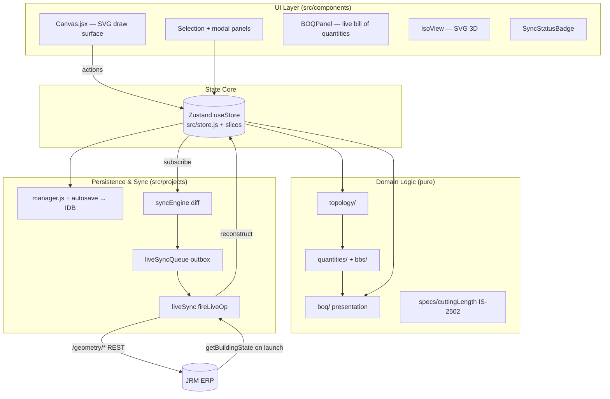

# Codebase Map — BOQ / Building Editor (`boq`)

> Auto-generated by Cartographer. Last mapped: 2026-06-27.
> Vite + React 19 + Zustand 5 SPA for architectural + MEP design documentation in Indian
> residential construction. It is the upstream **Building Editor** that feeds the JRM ERP
> (`erp-saas`) via a stable `ifcGlobalId` contract and live per-mutation geometry sync.
> Deploys to Cloudflare Workers. No backend of its own; IDB-first persistence.

## System Overview



**Five-layer architecture (data flows DOWN; mutations only at the top):**
`Geometry (Zustand store) → Topology (pure) → Quantities (pure) → BOQ Presentation → UI + Export`.
Topology and quantities are pure functions of state — no side effects. The editor is the
source of truth; the ERP building is always downstream.

## Directory Structure

```
src/
├── main.jsx / App.jsx       boot (parse #erpLaunch, IDB persistence, ERP session) + mount
├── store.js                 ~2700-line Zustand store (nodes/walls/rooms/stamps + UI + history)
├── structuralSlice.js       columns/beams/slabs/foundations + DEFAULT_PROJECT_SETTINGS + floors
├── mepSlice.js              6 MEP disciplines + risers (baseEntity)
├── store/                   legacyAccessors.js (planned slice-split migration contract)
├── operations/              journal-based op pipeline — DORMANT (zero live callers)
├── components/              52 components: Canvas, Toolbar, panels, BBS, MEP, BOQ, Iso, ERP, ui/
├── hooks/                   useKeyboardShortcuts, useUnits
├── topology/                wall junctions, room polygons, node graph, adjacency, beam endpoints (pure)
├── quantities/              masonry/plaster/tile/paint/joinery/steel aggregators (pure)
├── boq/                     scope wrappers → line emitters → presentation model
├── bbs/ + specs/            IS-2502 BBS catalog + RebarGroup generators
├── schema/                  entity schemas, integrity (FK graph), normalize, validate
├── snap/ + geometry.js      snapping + point-in-poly/intersection/centerline math
├── projects/                IDB persistence + the editor↔ERP LIVE SYNC layer
├── export/                  PDF (jsPDF), Excel (SheetJS), BBS exporters
├── revisions/ iso/ underlay/ mep/   named revisions, 3D view, PDF underlay, per-discipline engines
└── lib/ids.js               uid() / uidIfc() — the only crypto.randomUUID() call site
```

---

## State Core (`store.js`, slices, `operations/`)

A single **Zustand 5** store (`useStore`) holds every entity collection as `{ [internalId]: entity }` plus UI/view state and undo/redo history — all flat at the root (the namespaced model/view/history/validation/cache split is documented in `store/legacyAccessors.js` but **not yet implemented**). Every entity has an internal `id` (UUID, runtime) AND an `ifcGlobalId` (22-char base64, stable, the ERP + future IFC key). Structural mutators call `_save()` (snapshots 17 collections into a 50-frame ring buffer; view state excluded) and bump `boqRevision`. `_runAtomically(fn)` collapses a batch into one history frame (`_inBatch` suppresses nested `_save`). The `operations/` journal/dispatch pipeline exists fully but is **dormant** — the live store uses direct `set()`.

| File | Key actions/exports |
|---|---|
| `store.js` | `addWall/deleteWall/splitWall`, `addOpening/deleteOpening`, `saveRoom/addRectangleRoom/deleteRoom`, `getOrCreateNode`, `loadProject`, `_save/_runAtomically/undo/redo`, `setTool/setCurrentFloorId/setRate`, `assignElementLabels` |
| `structuralSlice.js` | `addColumn/addBeam/addBeamWithEndpoints/addSlab/addFoundation`, `setProjectSettings`, `addFloor`; exports `DEFAULT_PROJECT_SETTINGS`, `DEFAULT_FLOOR_ID='F1'` |
| `mepSlice.js` | `addPlumbingFixture/addElectricalPoint/addHvacUnit/addFireDevice/addElvDevice/addSolarEquipment/addRiser` + `select*`; `baseEntity` |
| `operations/` (dormant) | `OP_KIND`, `OPERATIONS` registry, `dispatch` |

**Entity shapes:** `Node{id,ifcGlobalId,x,y(in),floorIds,kind:CORNER|TJUNCTION,onWallId}` · `Wall{id,ifc,n1,n2(node ids),height,thickness,materialKey,openings[],floorId,junctions[],...}` · `Room{id,ifc,name,wallIds[],nodeOrder[],type,finishes,floorId}` · `Column{id,ifc,x,y,columnTypeId,baseFloorId,topFloorId}` · `Beam{id,ifc,endpoints:{from,to} 4-type union,level,source}` · `Slab{id,ifc,type,roomIds,thicknessIn,grade}` · MEP `baseEntity{id,ifc,discipline,type,x,y,wallId,roomId,...}`.

**Locked rules:** centerline storage is canonical (draw-mode converts at authoring boundary only); walls are **never split** (T-junctions are graph nodes in `wall.junctions[]`); `ifcGlobalId` is generated once, never changed; beam endpoints resolve through `resolveBeamEndpoint()` (4-type union); `DEFAULT_FLOOR_ID='F1'`; history is entity-only.

---

## UI Components (`src/components`, `src/hooks`)

`Canvas.jsx` is the central SVG drawing surface — all pointer/drag/click/keyboard handling for every tool, composes SVG layers (walls/nodes/rooms/columns/beams/stamps + MEP overlays), dispatches every mutation. Panels are selection-driven (one selection panel at a time, gated by `selected*Id`); modal panels gated by `activeTool`. `Toolbar.jsx` is data-driven from `toolbarConfig.js` (add a tool = one config entry). `FloorSwitcher` switches `currentFloorId`. `BOQPanel.jsx` is the right sidebar computing a live BOQ across civil/finishes/structural/MEP. `IsoView.jsx` is a painter's-algorithm SVG 3D view. ERP UI: `ErpConnection` + `ConnectErpDialog` + `SyncStatusBadge`.

| Group | Components |
|---|---|
| Drawing | Canvas, UnderlayLayer, canvas/{Plumbing,Electrical,Hvac,Fire,Elv,Clash}Overlay |
| Toolbar/nav | Toolbar (+toolbarConfig), FloorSwitcher, LayersPanel |
| Entity panels | OpeningPanel, OpeningDetailPanel, BulkWallPanel, RoomDetailPanel, ColumnPanel, BeamPanel, StampPanel |
| MEP panels | Plumbing/Electrical/Hvac/Fire/Elv panels, MepDefaultsModal |
| BBS | BBSSpecPanel, BBSSchedulePanel (computeRebarGroups), StructuralBOQSection |
| BOQ | BOQPanel + boq/*Section, RoomBreakdownPanel |
| Structural modals | SlabPanel, FoundationPanel, StaircasePanel, FloorsManagerPanel |
| Project mgmt | ProjectsPanel, ProjectSettingsPanel, RevisionsPanel, RevisionDiffPanel |
| ERP / 3D | ErpConnection, ConnectErpDialog, SyncStatusBadge, IsoView |
| ui primitives | Dialog, Toast, Modal, Panel, SelectionPanel, Button, Field, Dropdown, FeetInchesInput |

**Hooks:** `useKeyboardShortcuts` (single global listener, form-aware, exports `KEYBOARD_SHORTCUTS`), `useUnits` (unit-aware formatters — import instead of reading `state.unit`).

---

## Domain Logic — Topology, Quantities, BOQ, BBS (pure)

| Dir | Purpose | Key exports |
|---|---|---|
| `topology/` | room polygon/area, wall junctions, node graph, adjacency, beam endpoints | `getRoomPolygon/Area`, `resolveBeamEndpoint`, `getOrderedWallJunctions`, `getDerivedWallBeams/getAllBeams`, `computeBuiltUpAreaSft/computeCarpetAreaSft` |
| `quantities/` | masonry/plaster/tiles/paint/joinery/grills/shuttering/excavation aggregators | `getMaterialQuantities`, `getMasonryWithBeamDeduction`, `getPlasterQuantities`; attribution policies in `_metaContract.js` |
| `boq/` | floor/room scope wrappers, line emitters, presentation model | `scopeStateToFloor/Room`, `getBoqLines`, `computeBoqPresentationModel`, `computeScopeOfWork`, `computeProjectCosts` |
| `bbs/` | BBS entry + RebarGroup generators | `computeRebarGroups(state)→{groups,byElement,totals}`, `ELEMENT_TYPE/REBAR_ROLE/SHAPE_CODE` |
| `specs/cuttingLength.js` | IS-2502/IS-456/IS-13920 catalog (single BBS source) | `getIs2502Params`, `computeCuttingLengthMm`, `allowanceMm`, `developmentLengthMm`, `lapLengthMm` |
| `schema/` | entity schemas, FK integrity, normalize, validate | `verifyIntegrity(state)`, `FK_DESCRIPTORS`, `normalizeEntity`, `validateEntity` |
| `snap/` + `geometry.js` | snap targets/policy/resolver + geometry math | `SNAP_TARGETS`, `resolveSnap`, `SNAP_IN`, `GRID_IN`, `pointInPolygon`, `segmentsIntersect` |
| `materials.js`, `constants/structural.js`, `formulas/`, `compute/` | material library, steel/cement ratios, sub-formulas, dynamic registry | `MATERIAL_LIBRARY`, `BEAM_LEVEL_REGISTRY`, `STEEL_KG_PER_M3` |

**`buildPackage(state)` → ERP package `schemaVersion` (1/2/3):** v1 = spatial shell (floors→rooms[vertices/posXMm]→walls[dims/faceType/openings] + columns/beams/slabs + MEP elements); v2 = typed `structural` + `bbs` sub-objects per element (ERP never recalculates BBS); v3 = authoritative wall node graph per floor (`nodes[]` shared-node + `walls[]` n1/n2 ifc refs, openings gain `positionMm`). Boundary units: coords→mm int, lengths→ft, thickness→in; `ifcGlobalId` only (UUIDs stripped). Internal project save `SCHEMA_VERSION` is 8 (distinct from the ERP package version).

**Locked rules:** `RebarGroup` computed never persisted; IS-2502 is the single BBS source (no magic numbers in generators); beam endpoints via `resolveBeamEndpoint` (cycle-guarded); floor/room-scoped BOQ must go through `scopeStateToFloor/Room`.

---

## Persistence, ERP Sync & Export (`src/projects`, `src/export`)

Two-tier persistence. **Standalone:** IDB-first — `manager.js` (sync read cache + async IDB writes + BroadcastChannel cross-tab + localStorage migration) and `autosave.js` (30s debounced, **LOCAL IDB ONLY, never cloud** — a past auto-push wiped a live ERP model). **ERP-launch mode** (`#erpLaunch?buildingId=&token=&erpUrl=` hash): `erpLaunchContext` parses+strips the fragment → `erpSession.initErpSession` builds the floor-id map (creates F1 if new) → `initLiveSync` → `initLiveSyncQueue` → `hydrateFromErp` (GET `getBuildingState`, seed id-map, `reconstructSnapshot` → `loadProject`) → `startSyncEngine`. Thereafter a Zustand subscriber (`syncEngine`) diffs every committed change vs a shadow snapshot and enqueues ordered ops into a durable IDB-backed FIFO outbox (`liveSyncQueue`) that drains sequentially through `liveSync.fireLiveOp` (exp-backoff, 4xx → dead-letter) as `/geometry/*` REST calls.

| File | Purpose | Key exports |
|---|---|---|
| `projects/manager.js` | IDB-canonical project manager | `bootPersistence`, `createProject/openProject/saveCurrent`, `getCurrentProjectId`, `subscribe` |
| `projects/autosave.js` | 30s debounced Zustand→IDB (local only) | `installAutosave`, `buildSnapshot` |
| `projects/liveSync.js` | REST op dispatch + ERP→editor hydration | `initLiveSync`, `fireLiveOp`, `hydrateFromErp`, `GEOMETRY_OPS`, `registerErpId/resolveErpId` |
| `projects/liveSyncQueue.js` | durable FIFO outbox (IDB-persisted, retry/dead-letter, status pub/sub) | `initLiveSyncQueue`, `enqueueGeometryOps`, `getSyncStatus/subscribeSyncStatus`, `retryFailed/resyncAll` |
| `projects/syncEngine.js` | store subscriber + microtask-coalesced diff vs shadow | `startSyncEngine`, `stopSyncEngine`, `reconcileSyncEngine` |
| `projects/syncEmitters.js` | pure `{opType,payload}` builders in dependency order + `signature()` | `nodeAddOp/roomAddOp/roomVerticesOp/wallAddOp/openingAddOp/elementAddOp/...`, `buildFullSyncOps` |
| `projects/syncMappers.js` | the ONLY enum + unit conversion source | `inToMm/mmToIn`, `wallMaterial/wallOrientation/openingType` |
| `projects/elementRegistry.js` | **SSOT** for every `BuildingElementKind` (both directions) | `ELEMENT_REGISTRY`, `entryForErpKind/entryForCollection` (`collection/erpKind/erpOpType/toErpPayload/toEditorShape`) |
| `projects/erpReconstruct.js` | ERP state → `loadProject` snapshot (mm→inch, id=ifc=sourceEditorId) | `reconstructSnapshot` |
| `projects/erpSession.js` / `erpLaunchContext.js` | ERP boot orchestration / hash parse | `initErpSession` / `parseErpLaunchHash`, `getErpLaunchContext` |
| `projects/cloudConn.js` / `connectHandoff.js` | global ERP connection + token cache / older `#connect` deep-link | `getCloudConn/getValidAccessToken` / `runConnectHandoff` |
| `projects/storage/` | IDB schema + adapters (`indexedDb.js`, `idbAdapter.js`, `getAssetStorage`, `assets.js`) | `createPersistence`, `DB_STORES` |
| `export/` | `pdf.js` (jsPDF), `excel.js` (SheetJS), `bbs.js` — consume the presentation model, render only | `exportBoqPdf/exportBoqExcel/exportBbsExcel` |
| `lib/ids.js` | the only `crypto.randomUUID()` site | `uid`, `uidIfc`, `newEntityIds` |

**Locked rules:** autosave is LOCAL-only; **reconstruction emits ZERO ops** (engine shadow seeded after `loadProject`); `sourceEditorId == ifcGlobalId == internal id` identity on reconstruct (so wall→node refs + id-map resolve for UPDATE not duplicate ADD); coordinate mapping lives ONLY in `syncMappers`/`elementRegistry`; enum mappers are total (never throw — fall back to OTHER/INTERNAL/WINDOW); queue is strictly FIFO-sequential (encodes parent-before-child ordering); **a new element kind = ONE entry in `elementRegistry.js`** (syncEngine/syncEmitters/erpReconstruct are all registry-driven); `roomTypeCode` intentionally omitted from `roomAddOp` (ERP defaults to OTHER).

---

## Navigation Guide

| Task | Where to work |
|---|---|
| Add a structural entity | `structuralSlice.js` (action) + a `*Panel.jsx` + Canvas rendering + a `quantities/`/`bbs/` aggregator |
| Add an MEP system | `mep/[discipline]/` + `mepSlice.js` + a panel + a `boq/*Section.jsx` |
| Fix a BOQ calculation | `quantities/*.js` (pure) or `boq/` presentation; add a `scripts/verify-*.mjs` |
| Fix a BBS number | `specs/cuttingLength.js` (single source) + `bbs/` generators |
| Change canvas behavior | `components/Canvas.jsx` |
| Add a new ERP-synced element kind | ONE entry in `projects/elementRegistry.js` — nothing else |
| Touch the live sync | `projects/syncEngine.js` (diff) / `syncEmitters.js` (ops) / `liveSync.js` (REST) / `liveSyncQueue.js` (outbox) |
| Add an export format | `export/*.js` (consume `computeBoqPresentationModel`) |
| Verify | `npm run verify` (38 Node assertion scripts); `npm run build` (Vite); `npm run lint` |

For phase history and deep dives, see `docs/CLAUDE-phase-history.md` and `docs/CLAUDE-boq-reference.md`. Architectural rules live in the root `CLAUDE.md`.

---
*Generated by Cartographer (Opus orchestration + parallel Sonnet `Explore` subagents). Source scanned: 656 files. The scanner's token counter (tiktoken/uv) was unavailable, so totals are byte-estimated.*
