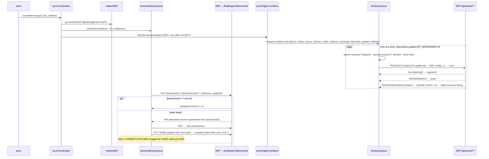

# Codebase Map — BOQ / Building Editor (`boq`)

> Last mapped: **2026-09-23T10:52:32Z** against `main` @ `f750c72` (3 commits ahead of `origin/main`, not pushed). Doc edits after the map (2026-09-23/24) were committed on top of it.
> Full re-map + audit. Supersedes the 2026-07-02 map. Every claim below was checked against code; defects are in the
> **Known Defects** register (§10) with `file:line`.

Vite + React 19 + Zustand 5 SPA (JavaScript, no TypeScript) for drawing Indian residential buildings (walls, rooms,
structure, MEP) and producing a live editor-side BOQ + IS-2502 BBS. It is the upstream **Building Editor** for the JRM ERP
(`erp-saas`): in ERP-launch mode it writes a **canonical Building Document** (R2, via the ERP) and a **live geometry
projection** (`/api/v1/geometry/**`). No backend of its own; IndexedDB-first persistence; deployed to Cloudflare Workers.

---

## 1. System overview

```mermaid
graph TB
  subgraph UI["UI (src/components, flat-mounted in App.jsx)"]
    Canvas[Canvas.jsx — SVG draw surface<br/>drawing + placement + selection]
    Panels[~40 self-gating panels/modals<br/>gate on activeTool or selected*Id]
    BOQP[BOQPanel + boq/*Section]
    Banners[SyncStatusBadge · EditorReadOnlyBanner<br/>ProjectionMismatchBanner]
    Keys[hooks/useKeyboardShortcuts]
  end
  subgraph State["State (ONE flat zustand store)"]
    Store[(useStore: store.js<br/>+ structuralSlice + mepSlice)]
    Getters[store quantity getters<br/>masonry/steel/concrete/civil]
  end
  subgraph Pure["Pure domain"]
    Topo[topology/] 
    Snap[snap/]
    Qty[quantities/]
    MEP[mep/ engines + catalogs]
    BBS[bbs/ + specs/cuttingLength]
    Boq[boq/ scope → lines → presentationModel]
    Iso[iso/]
  end
  subgraph Sync["projects/ (ERP mode)"]
    Coord[syncCoordinator<br/>ACCEPT → EMIT]
    CQ[canonicalDoc + canonicalSyncQueue]
    Eng[syncEngine diff → syncEmitters]
    LQ[liveSyncQueue → liveSync.fireLiveOp]
    Reopen[canonicalReopen · projectionGuard/Reconstruct]
  end
  Local[manager.js + autosave → IDB<br/>(local-project mode)]
  ERP[(JRM ERP)]

  Canvas -->|store actions| Store
  Panels -->|store actions| Store
  Keys --> Store
  Store --> Getters --> Boq
  Topo --> Getters
  Qty --> Boq
  MEP --> Boq
  BBS --> BOQP
  Boq --> BOQP
  Snap --> Canvas
  Store -->|subscribe| Coord
  Coord -->|1 ACCEPT: IDB snapshot + dirty| CQ -->|PUT /building-structure/buildings/:id/document| ERP
  Coord -->|2 EMIT| Eng --> LQ -->|/geometry/** REST| ERP
  ERP -->|GET document + GET state| Reopen -->|loadProject| Store
  Store --> Local
```

**Layering (true today):** Geometry (store) → Topology (pure) → Quantities (split: pure `quantities/` + `mep/quantities/`
**and store getters** in `store.js`/`structuralSlice.js`) → `boq/` presentation → UI/export. Topology is pure; the
masonry/structural/civil quantity engine lives in store getters (not pure modules).

**Nothing in the editor BOQ pipeline reaches the ERP.** The canonical doc carries raw entities + `ratesByKey`; the projection
carries geometry. The ERP computes its own quantities and is authoritative for everything commercial.

---

## 2. Directory structure

| Path | Files / lines | Purpose |
|---|---|---|
| `src/main.jsx` | 82 | Boot: parse+strip `#erpLaunch`, `installAutosave`, `bootPersistence` → taxonomy cache → `initErpSession` (ERP only) → render |
| `src/App.jsx` | 157 | Legacy `#connect` handoff screen, else `DesktopGate` + every panel mounted flat (App.jsx:116-153). **No `Panels.jsx`.** |
| `src/store.js` | 2526 | The zustand store: nodes/walls/rooms/stamps, UI keys, history, `loadProject`, quantity getters |
| `src/structuralSlice.js` | 2170 | columns/beams/slabs/staircases/foundations, `DEFAULT_PROJECT_SETTINGS`, floors, structural quantity getters |
| `src/mepSlice.js` | 490 | 6 MEP disciplines (plumbing, electrical, hvac, fire, elv, solar) + risers |
| `src/components/` | 87 files / 19.5k | 75 `.jsx` (42 top-level, `boq/` 17, `canvas/` 6, `ui/` 10) + `toolbarConfig.js` + CSS |
| `src/hooks/` | 2 | `useKeyboardShortcuts` (global shortcut registry), `useUnits` |
| `src/lib/` | 4 | `ids.js` (only `crypto.randomUUID` site), `numbers.js`, `units.js`, `columnShapes.js` |
| `src/constants/` | 5 | `boqCategories`, `joinery`, `layers`, `structural`, `units` |
| top-level `geometry.js`, `materials.js`, `roomPresets.js`, `formulas.js` | — | geometry primitives/constants; material library; `ROOM_TYPES`/presets; BOQ "explain" popovers |
| `src/topology/` | 19 / 4,030 | Pure spatial relationships (rooms, faces, junctions, adjacency, beams, surfaces, floors, building area) |
| `src/snap/` | 6 / 1,186 | Unified snap resolver + per-tool policy + beam endpoint target |
| `src/draw/` | 1 / 199 | `faceToCenterline.js` — authoring-boundary face→centerline conversion |
| `src/quantities/` | 12 / 2,303 | Pure aggregators: `_metaContract, bbs (legacy steel), ceilingFinish, doorHardware, excavation, foundations, grills, joinery, paint, plaster, shuttering, tiles` |
| `src/boq/` | 13 / 3,725 | `scope`, `lines`, `presentationModel`, `projectCosts`, `roomBreakdown`, `_contingencyResolver`, `_scopeOfWork`, `elementLabels`, `emitters/{plumbing,electrical,hvac,fire,elv}` |
| `src/mep/` | 83 / 9,302 | 5 discipline engines, 25 catalogs, `shared/`, `quantities/`, `resolution.js`, `validation/` |
| `src/bbs/` | 11 / 2,700 | `computeRebarGroups` + 8 generators + `types.js` + `concrete.js` |
| `src/specs/` | 11 / 1,950 | `cuttingLength.js` (IS-2502 catalog), `reinforcementSpecs.js` (legacy steel), finish/masonry/hardware systems, `resolution.js`, `catalogManifest.js` |
| `src/schema/` | 22 / 1,950 | 17 entity schemas, `integrity.js` (`FK_DESCRIPTORS`), `normalize.js`/`validate.js` (unused in prod) |
| `src/projects/` | 30 / 5,315 | Local persistence (`manager`, `autosave`, `storage/`) + the ERP sync layer (§4.3) |
| `src/revisions/` | 3 / 605 | Named revisions (localStorage) + diff |
| `src/validation/` | 9 / 523 | Warning-only rule engine (7 structural rules + `MEP_RULES`) |
| `src/export/` | 4 / 1,082 | `pdf.js`, `excel.js`, `bbs.js`, `_buckets.js` (no CSV exporter) |
| `src/formulas/` | 5 / 570 | Structural "explain" formula builders |
| `src/iso/` | 6 / 778 | Pure iso projection/solids/painter sort for `IsoView` |
| `src/underlay/` | 2 / 202 | PDF render (pdfjs) + calibration math |
| `src/ghosts/` | 1 / 79 | Room-type "ghost" items (view-only) |
| `src/design/tokens.css` | 1 | Design tokens |
| `src/operations/` | 5 / 895 | **DORMANT** op registry/dispatch (§3.10, §11) |
| `src/compute/` | 3 / 343 | **DEAD** computation DAG (no src consumer) |
| `src/store/legacyAccessors.js` | 130 | **EXPIRED** slice-split shim (kill date 2026-08-15) |
| `scripts/` | 54 | 52 `verify-*.mjs` + `validate-bbs-karthick.mjs` + `resolver-hook.mjs` |
| root | — | `vite.config.js` (react + `@cloudflare/vite-plugin`), `wrangler.jsonc`, `eslint.config.js`; `index.html` title and `package.json` name are still `house-layout`; two sample BBS workbooks (`*.xlsx`) |

No `tests/` dir, no Jest/Vitest, no npm `verify`/`test` script, no git hooks (`.git/hooks` = samples only).

---

## 3. Module guide

### 3.1 Store (`store.js` + 2 slices)

- **One flat store** `create((set,get)=>({...}))` (store.js:124); slices spread last (store.js:2520 `createStructuralSlice(set,get,uid)`, 2523 `createMepSlice(...)`) — a same-named slice key silently wins. No `persist`, no `immer`; actions return spreads. `window.useStore` exposed only in DEV (store.js:117-122).
- **Collections** (all `{[id]: entity}`): `nodes, walls, rooms, stamps` · `columns, beams, slabs, staircases, foundations` · `plumbingFixtures, electricalPoints, hvacUnits, fireDevices, elvDevices, solarEquipment, risers` (16). Openings live in `wall.openings[]`; floors in `projectSettings.floors[]` (with per-floor `underlay`).
- **UI keys**: `activeTool` (default `'draw'`), `drawStartId`, `selectedWallId`, `selectedWallIds[]`, `selectedStampId`, `selectedRoomId`, `selectedOpening{wallId,openingId}`, `selectedColumnId/BeamId/FoundationId`, `selected<Mep>Id`, `selectedElectricalPointType`, `selection{}` (namespaced highlights), `draftOpening`, `unit`, `showDimensions`, `layerVisibility`, `currentFloorId` (`'F1'`), `ratesByKey`, `boqRevision`, `ratesRevision`, `validationEvents[]` (ring 100). Pan/zoom are Canvas local state.
- **History**: 50-frame `history/future`. `_save()` snapshots the 16 collections and bumps `boqRevision` (store.js:208-216). `projectSettings` (floors, column types, all settings) is **not** in history. `_runAtomically(fn)` = one frame for a gesture (store.js:227-236). `undo/redo` store.js:238-302.
- **Key actions**: `getOrCreateNode` (333), `getOrCreateNodeFaceJoin` (464), `addWall(n1,n2)` (478), `addRectangleRoom` (530), `detectFaceFromWallClick` (648), `createRoomFromFace` (664 — the room-creation path), `deleteWall` (731), `setBulkWallProp` (933), `splitWall` (964), `joinWalls` (1161), opening CRUD `addOpening` (1399) / `updateOpening` (1507) / `removeOpening` (1485) / `setOpening*`, stamps (`addStamp` 1596…), rooms (`saveRoom` 1689, `setRoom*`, `acceptGhost` 1808, `renameRoom` 1934, `deleteRoom` 1942), `loadProject` (1955-2293, hand-written normalisation/default-injection), read/quantity getters (2297-2517).
- **structuralSlice**: `DEFAULT_COLUMN_TYPES` (95), `DEFAULT_FLOOR_ID='F1'` (102), `DEFAULT_PROJECT_SETTINGS` (108-322); ~30 settings setters (361-748), floors `addFloor/removeFloor/updateFloor` (578-636), columns (751-943), foundations (949-1062), beams (`addBeam` 1066, `addBeamWithEndpoints` 1100), `applyReinforcementSpecToMatching` (1195), slabs (1260-1416), wall BBS flags, and **quantity getters** `getColumnQuantities` (1598) … `getSteelQuantities` (1901), `getConcreteByGrade` (2001), `getMasonryWithBeamDeduction` (2061), `getMasonryByThickness` (2128), memoized via `topology/cache.createMemo`.
- **mepSlice**: `baseEntity` (35), add/update/delete/select × 6 disciplines + risers, `addElectricalPoint(...,roomId,pointType)` resolves room via `pointInRoom` (131-152), `setHvacPairing` (211), `applyRoomMepDefaults` (393), `_normalizeMepCollection`.
- **Persisted** (via `projects/_snapshot.buildSnapshot`, `version: 7`): 16 collections + `ratesByKey` + `projectSettings`. Not persisted: `unit`, `layerVisibility`, `showDimensions`, selections.

### 3.2 Components / canvas

- All panels are always mounted by App.jsx and self-gate: **modal tools** on `activeTool === '<id>'` (close = `setTool('select')`), **selection panels** on a `selected*Id`. Tools are declared in `components/toolbarConfig.js`.
- **Canvas.jsx** (2361): world inches, Y-up; `sx=x*PX_PER_INCH`, `sy=-y*PX_PER_INCH` (60-61); pan (right/middle/Space drag), wheel zoom 0.1-10×. Every click goes through `runSnap` → `snap/resolveSnap` (536-549). Owns drawing/placement/selection only; entity edits happen in panels.
  - **Walls**: centerline mode = per-click commit; face modes (`inside_face` default) buffer clicks and commit via `_commitFaceChain` → `convertFacePointsToCenterline` → `_runAtomically(getOrCreateNodeFaceJoin + addWall)` (852-970).
  - **Rooms**: `room_detect` (label "Room", key R) → `detectFaceFromWallClick` → `createRoomFromFace` + auto-MEP (995-1045); `rect_room` (Shift+R) two clicks → `addRectangleRoom` (783-830). Manual wall-pick Room tool is retired.
  - **Openings** created from `OpeningPanel` (live `draftOpening`), not a canvas tool. **Split/Join**: `splitWall` / `joinWalls` (1051-1134). **Beams**: `resolveBeamTarget` → level picker → `addBeamWithEndpoints` (711-730, 1191-1220). **Columns**: standalone placement (701-710).
  - Multi-floor: off-floor entities render as ghosts (1154-1167). No dimension tool; `showDimensions` toggles wall-length labels.
- **Key panels**: OpeningPanel (wall props + add opening), OpeningDetailPanel, BulkWallPanel, RoomDetailPanel (938; finishes, ERP `roomTypeCode`, ghosts, per-room BOQ), Column/Beam/Stamp/Staircase/Slab/FoundationPanel, BBSSpecPanel/BBSSchedulePanel, 5 MEP panels + `ElectricalPointPalette` + `MepDefaultsModal`, BOQPanel (983) + `boq/*Section`, RoomBreakdownPanel, ProjectSettingsPanel (1122), Projects/Revisions/RevisionDiffPanel, IsoView, CalibrationModal + PDFPagePickerModal + UnderlayLayer (underlay workflow), HelpGuide, LayersPanel, FloorSwitcher/FloorsManagerPanel, DesktopGate, ErpConnection/ConnectErpDialog (legacy), SyncStatusBadge, EditorReadOnlyBanner, ProjectionMismatchBanner.
- **canvas/** overlays: `{Plumbing,Electrical,Hvac,Fire,Elv}Overlay` (devices + risers; route rendering is dead — KD-22), `ClashOverlay` (builds networks/routes itself).
- **ui/**: Button, Dialog (+`dialog.confirm/alert/prompt`), Toast (+`toast.*`), Modal, Panel, SelectionPanel, Field, Dropdown, FeetInchesInput, InchesInput.
- **Event bus** (window `CustomEvent`): `canvas:end-chain`, `boq:toggle`, `snap:toggle`, `toolbar:close-dropdowns`, `mep:room-created`, `underlay:page-picker`.
- **Shortcuts**: `useKeyboardShortcuts.KEYBOARD_SHORTCUTS` registry (single window listener; bare keys suppressed in inputs). Canvas also keeps its own keydown listener (Canvas.jsx:405-438) — see KD-18.

### 3.3 Projects / sync layer (`src/projects/`) — see §4 and §5 for flows

| File | Lines | Role | Notes |
|---|---|---|---|
| `erpLaunchContext.js` | 62 | parse `#erpLaunch?buildingId&token&erpUrl[&refreshToken&expiresAt]` | `isErpLaunchMode` |
| `erpSession.js` | 226 | ERP boot orchestration (§4.3) | |
| `editorAuth.js` | 83 | proactive token refresh (60 s skew) via `POST /auth/editor-session/refresh` | |
| `erpConnection.js` | 80 | source-agnostic connection registry (used by `taxonomy`) | |
| `editorWriteGuard.js` | 108 | HARD read-only latch (integrity / 3 stale-base conflicts) + releasable offline flag | UI does not consult it (KD-23) |
| `syncCoordinator.js` | 112 | THE store subscriber in ERP mode: ACCEPT then EMIT (77-109) | |
| `canonicalDoc.js` | 109 | `buildSnapshotDoc` `{schemaVersion, checksum, payload}`, GET/PUT document | |
| `canonicalSyncQueue.js` | 331 | single-slot latest-wins upload; 409 refetch-retry; 3 conflicts → latch | KD-1, KD-2, KD-13 |
| `canonicalReopen.js` | 80 | seed id-map → R2 doc → IDB → integrity-failed / empty | |
| `projectionGuard.js` | 73 | canvas-vs-projection count check + banner + `loadFromErp` | |
| `projectionReconstruct.js` | 270 | ERP state → editor payload (nodes/walls/openings/rooms only) | KD-3, KD-4 |
| `syncEngine.js` | 219 | shadow diff → ordered ops (coordinated mode only in prod) | KD-8, KD-9 |
| `syncEmitters.js` | 231 | pure op builders, `signature`, `buildFullSyncOps` (Resync all) | |
| `syncMappers.js` | 75 | `inToMm/mmToIn` + enum mappers | a 2nd `inToMm` lives in liveSync.js:4-5 |
| `elementRegistry.js` | 119 | element-kind registry (COLUMN, BEAM, SLAB, STAIRCASE, FOUNDATION, RISER, 6×MEP), editor→ERP only | `toEditorShape`/`entryForErpKind` unused |
| `liveSync.js` | 787 | `fireLiveOp` (op→HTTP, id resolution), `OP_DEPENDENCY` (47-100), `seedIdMapFromErp` (765-787) | dead cases KD-list §11 |
| `liveSyncQueue.js` | 259 | durable FIFO outbox + dependency gate (154-198) + classifier (126-136) | |
| `taxonomy.js` | 143 | ERP RoomType list + IDB cache | |
| `erpEnvelope.js` | 18 | unwrap `{success,data}` | 3 more private copies exist |
| `cloudConn.js`, `connectHandoff.js` | 230, 177 | **legacy** manual connect + `#connect` deep link | target ERP routes no longer exist (KD-15) |
| `manager.js`, `autosave.js` | 417, 62 | local-project IDB manager (BroadcastChannel); 30 s autosave (no-op in ERP mode) | |
| `_snapshot.js` | 28 | `buildSnapshot` — `version: 7` | |
| `schemaVersion.js` | 119 | `runMigrations` (v8→v8 no-op) | **no src importer** |
| `templates.js` | 246 | project templates, id remap via `FK_DESCRIPTORS` | |
| `storage/` | 4 | IDB `boq-app` v3 (stores: projects, chunks, journal, snapshots, revisions, catalogs, assets, metadata, templates), adapters, asset blobs | |

### 3.4 BOQ pipeline (editor-local)

```
store collections + projectSettings + ratesByKey
  ├─ store getters (getMasonryWithBeamDeduction, getSteelQuantities, getConcreteByGrade, getSumpCivilQty, …)
  ├─ quantities/* (plaster, tiles, paint, joinery, grills, shuttering, excavation, foundations, ceilingFinish, doorHardware, bbs[legacy steel])
  └─ mep/quantities/* (wrapped as state.get<X>Quantities in boq/scope.js:643-664; solar stubbed empty 661-663)
        ↓
boq/scope.js   scopeStateToFloor / Room / RoomType
        ↓
boq/lines.js   getBoqLines(state, rates, {floorId|roomId|roomType}) → BoqLine[]  (+ emitters/*)
        ↓
boq/presentationModel.js  computeBoqPresentationModel (+ contingency, projectCosts, scopeOfWork)
        ↓
BOQPanel · RoomDetailPanel · RoomBreakdownPanel · export/{pdf,excel} · revisions/snapshot
```

- **BOQ steel lines come from the legacy path** `boq/lines.js:37,248` → `quantities/bbs.computeBBSQuantities` → `specs/reinforcementSpecs.compute*BBS` — **not** from `computeRebarGroups` (KD-29).
- MEP emitters for ELV / fire sprinkler / electrical conduit+MCB+DB read field names the engines don't produce (KD-27).

### 3.5 Schema (`src/schema/`)

17 entity schemas (`entities/index.js:27-45`; opening nested in wall). Each: `entityType`, `storeSlice`, `fields`, `invariants`, `legacyAliases`. **Ids**: internal `id` (UUID v4, `uid()`) + `ifcGlobalId` (22-char IFC GUID, `uidIfc()`), minted only in `lib/ids.js`. ERP `sourceEditorId` **= `ifcGlobalId`** (not the internal id); floors use their `id` (`'F1'`) directly. `integrity.js` `verifyIntegrity`, `FK_DESCRIPTORS` (:483, used by `templates.js`). **Production `loadProject` uses none of `normalize/validate/verifyIntegrity/runMigrations`** — the schema layer is a verify-script contract.

### 3.6 Quantities

Pure `compute*Quantities(state)` style aggregators with `_metaContract.buildMeta` attribution. Masonry, structural concrete/steel and civil (sump/septic/excavation) quantities are **store getters** (store.js:2295-2517, structuralSlice.js:1598-2170). Parallel re-derivations exist in `formulas.js:13-40`, `RoomDetailPanel.jsx:152-176`, `StampPanel.jsx:93`.

### 3.7 MEP (`src/mep/`)

- Per discipline (`plumbing, electrical, hvac, fire, elv`): `network.js` (`build<X>SystemGraph`) → `routing.js` (wall-perimeter walk, zone-tagged) → `sizing.js` → `suggestions.js` (room defaults) → placement helpers. Plumbing adds `drainage.js`, `hotwater.js`; electrical adds `circuitGrouping.js`, `dbPlacement.js`, `submains.js`.
- `quantities/<x>.js` `compute<X>Quantities(state)` → `{perSystem:{…}, …counts, risers, totals}` (authoritative shapes: boq-03 report §MEP).
- `catalogs/` — frozen registries with `CATALOG_VERSION`/`CATALOG_SOURCE`; barrel builds `CATALOG_VERSIONS` (catalogs/index.js:100-126). `electricalPointTypes.js` = canonical 17-value `pointType` synced to ERP (not in `CATALOG_VERSIONS`); `pointTypes.js` = 15 IS-732 glyph/load ids; `POINT_TYPE_TO_CATALOG` maps coarsely (electricalPointTypes.js:53-71).
- `shared/` — systemGraph, routingZones, sizingStrategy, fittingCounter, risers, suggestions, clashDetection, geometry. `resolution.js` (per-instance overrides). `validation/` `MEP_RULES` (registered validation/engine.js:23).
- ERP receives only placed MEP elements (via `elementRegistry`), never MEP quantities.

### 3.8 BBS / specs

- `computeRebarGroups(state,{floorId?})` (bbs/index.js:115-231) → `{groups, byElement, totals:{totalWeightKg, byCategory, byDiameter, byBbsCategory}, standardBarLengthM, paramsVersion}`. Walks columns → foundations (+inline footings) → beams (incl. wall-derived) → slabs → tie beams (`wall.hasTieBeam`) → sunshades → lofts → staircases.
- Generators: column, beam, footing, strapFooting, slab, sunshade, loft, staircase. `bbs/types.js` (`makeRebarGroup`, 16 `BBS_CATEGORY`s, mark prefixes). `bbs/concrete.js` (concrete per category).
- `specs/cuttingLength.js` (`CATALOG_VERSION '2026-05-29-IS-2502-V2'`): bend deductions, hook 9d, Ld factors (IS 456 Cl 26.2.1), lap, crank (exact `rise/sin θ`), IS 13920 confinement; `SITE_PRACTICE_PARAMS` merged when `projectSettings.bbsAllowanceMode==='SITE_PRACTICE'`; `allowanceMm` is the IS_STRICT↔SITE switch. Default standard bar length **12 m**.
- `specs/reinforcementSpecs.js` = **legacy steel path still live** for BOQ steel (KD-29). `specs/resolution.js` = tiered spec resolution (INSTANCE → WALL_INSTANCE → project `bbsDefaults` → preset/ESTIMATE).
- Consumers: `BBSSchedulePanel`, `export/bbs.js`. **BBS is never synced to the ERP** (no `bbs`/`structural` payload in `src/projects/`).

### 3.9 Topology / snap / iso

- **topology/** (barrel `index.js`, pure, memoized by reference): `rooms.js` (polygon/area, dimension-mode kernel `getRoomGeometry`, offset kernel), `faces.js` (planar face enumeration for click-to-detect), `adjacency.js` (`getFloorWallPerimeterGraph` for MEP routing), `buildingArea.js` (carpet/built-up), `junctions.js`, `wallSplit.js`, `canMerge.js`, `segmentClassify.js`, `nodeOrderRefresh.js`, `walls.js`, `openings.js`, `columns.js`, `beams.js` (`resolveBeamEndpoint`, `getAllBeams`), `foundations.js`, `floor.js`, `surfaces.js`, `wet.js`, `cache.js`.
- **snap/**: `resolveSnap(state, screenXY, ctx)` (`resolver.js`), `SNAP_TARGETS` (`targets.js`), `TOOL_SNAP_POLICY` (`toolPolicy.js`), `candidates.js`, `beamTarget.js`. Bypass key = `projectSettings.snap.bypassKey` (Alt), F9 toggles.
- **iso/**: projection, solids, extrude, painter sort, colors, view presets → `IsoView.jsx` only.

### 3.10 Export / revisions / validation / operations status

| Area | Status |
|---|---|
| `export/` | `pdf.js` (jsPDF + autotable), `excel.js` (SheetJS), `bbs.js` (BBS workbook), `_buckets.js`. Render-only over the presentation model. No CSV. |
| `revisions/` | `buildRevisionSnapshot` (full payload + frozen BOQ summary + validation + `APP_VERSION='2.5.0'`); stored in **localStorage** `boq_revisions:<projectId>`, cap 30 with silent pruning incl. manual; **none in ERP mode** (KD-16). |
| `validation/` | `runValidation(state,{scopes})`, 7 structural rules + MEP rules; warnings only; used by BOQ footer + revisions. |
| `operations/` | **DORMANT.** ~40-op registry + `dispatch` + `transaction`; only `_schemaVersion.js` is imported (by the unused `projects/schemaVersion.js`). Exercised only by `verify-operations/op-kinds/op-purity`. Op names overlap the sync wire vocabulary but are a different, non-replayable model. |
| `compute/` | **DEAD** (no src consumer; 2 verify scripts). |
| `store/legacyAccessors.js` | **EXPIRED** kill-switch `2026-08-15`, 50 accessors; `verify-legacy-shim` fails (KD-31). |

---

## 4. Data flows

### 4.1 Edit → store → BOQ recompute

```mermaid
sequenceDiagram
  participant U as User
  participant C as Canvas / Panel
  participant S as useStore action
  participant H as history (_save)
  participant B as BOQPanel
  participant L as boq/lines + scope
  U->>C: click / edit
  C->>S: action (often inside _runAtomically)
  S->>H: _save() — snapshot 16 collections, bump boqRevision
  S->>S: set(s => ({...spread}))
  Note over S: projectSettings setters do NOT _save or bump boqRevision
  S-->>B: zustand notifies subscribers (9 geometry/structural keys + projectSettings + ratesByKey; NOT MEP)
  B->>L: getBoqLines(getState(), rates, {floorId}) — recomputed every render, no memo
  L->>S: store getters (masonry/steel/concrete/civil)
  L-->>B: BoqLine[] → groupBoqLinesByCategory → computeBoqPresentationModel
```

### 4.2 Editor ↔ ERP sync (per committed change, incl. 409)


```mermaid
sequenceDiagram
  participant S as store
  participant Co as syncCoordinator
  participant IDB as IndexedDB
  participant CQ as canonicalSyncQueue
  participant Doc as ERP …/buildings/:id/document
  participant E as syncEngine+emitters
  participant LQ as liveSyncQueue
  participant G as ERP /geometry/**
  S->>Co: committed change (not _inBatch)
  Co->>IDB: put SNAPSHOTS[buildingId] (ACCEPT)
  Co->>CQ: noteCanonicalDirty + 10 s debounce
  Co->>E: flushSyncEngine(state) (EMIT, only after ACCEPT)
  E->>LQ: enqueue ordered ops (floors, nodes, rooms, vertices, walls, surfaces, openings, elements, updates, deletes)
  loop one at a time, dependency-gated (OP_DEPENDENCY)
    LQ->>LQ: parent resolved? dispatch : queued producer? blocked : drop+warn
    LQ->>G: POST/PATCH/DELETE (editor ids → ERP UUIDs, in → mm)
    G-->>LQ: 2xx {data:{id}} → registerId
    G-->>LQ: 400/404/409/422 → dead
    G-->>LQ: 401/403/408/429/5xx/network → backoff 1/2/4/4 s ×5 → failed (manual Retry)
  end
  CQ->>Doc: PUT {baseVersion, schemaVersion:7, checksum, payload}
  alt baseVersion == server
    Doc-->>CQ: {snapshotVersion n+1}
  else stale base
    Doc-->>CQ: 409 stale-base (server quarantines the rejected blob)
    CQ->>Doc: GET → new baseVersion
    CQ->>Doc: PUT SAME payload with new base → accepted (last-writer-wins, KD-1)
    Note over CQ: only 3 CONSECUTIVE 409s engage the HARD read-only latch
  end
```

### 4.3 Load from ERP (boot / reopen / explicit reconstruction)

```mermaid
sequenceDiagram
  participant FE as ERP frontend
  participant Ed as erpSession
  participant G as ERP
  participant St as store
  FE->>G: POST /auth/editor-session {buildingId} → token 15 m + refresh 12 h
  FE->>Ed: open #erpLaunch?buildingId&token&erpUrl&refreshToken&expiresAt (main.jsx strips it)
  Ed->>Ed: initEditorConnectionWatch, initEditorAuth (refresh timer)
  Ed->>G: GET /building-structure/buildings/:id/floors (none → POST /geometry/buildings/:id/floors F1 = new building)
  Ed->>Ed: initLiveSync (clears id-map), setErpConnection, initLiveSyncQueue (reload persisted ops)
  Ed->>G: GET /geometry/buildings/:id/state → seed sourceEditorId→id map (never loads canvas)
  Ed->>G: GET document
  alt checksum ok
    Ed->>St: loadProject(payload) verbatim
  else IDB SNAPSHOTS ok
    Ed->>St: loadProject(IDB copy)
  else server doc bad, no IDB rescue
    Ed->>Ed: HARD read-only latch, write pipeline NOT started
  else nothing
    Ed->>St: empty canvas
  end
  Ed->>G: GET state → checkProjectionMismatch (projection has more rooms/walls?)
  opt user clicks "Load from ERP" (ProjectionMismatchBanner)
    Ed->>St: reconstructFromProjection → loadProject (nodes/walls/openings/rooms only; projectSettings reset) — KD-3, KD-4
  end
  Ed->>Ed: initCanonicalSyncQueue → startSyncEngine({coordinated}) → startSyncCoordinator
```

---

## 5. Editor ↔ ERP contract

All paths under `/api/v1`. Geometry routes use `EditorSessionGuard` and `ValidationPipe({whitelist, forbidNonWhitelisted})` (erp-saas `geometry-live.controller.ts:49`).

| Editor op / caller | Route | Editor sends | Backend DTO accepts | Drift |
|---|---|---|---|---|
| ADD_FLOOR | POST `/geometry/buildings/:id/floors` | `sourceEditorId` (floor id, `'F1'`), `floorNumber`, `floorHeight` (ft) | `CreateFloorGeometryDto` | — |
| UPDATE_FLOOR | — | no-op (liveSync.js:380-383) | no PATCH route | floor edits never sync (KD-10) |
| DELETE_FLOOR | DELETE `/geometry/floors/:id` | — | soft-deletes subtree | — |
| ADD_ROOM | POST `/geometry/floors/:floorId/rooms` | `sourceEditorId`=ifc, name, `roomTypeCode` when authored | `CreateRoomGeometryDto` (idempotent by sourceEditorId) | room-type change re-emits ADD_ROOM (PATCH is shape-only) |
| SAVE_ROOM_VERTICES | POST `/geometry/rooms/:id/vertices` | vertices (mm) | server derives area/perimeter | — |
| ADD_WALL / UPDATE_WALL / DELETE_WALL | POST `/geometry/rooms/:roomId/walls`, PATCH/DELETE `/geometry/walls/:id` | n1/n2 node refs, `heightMm`, `thicknessMm`, material | Create/PatchWallGeometryDto | walls owned by no room never sync (KD-9) |
| ADD_WALL_SURFACE | POST `/geometry/walls/:id/surfaces/adjacent` | wall + adjacent room | ✓ | — |
| ADD/DELETE_OPENING | POST `/geometry/walls/:wallId/openings`, DELETE `/geometry/openings/:id` | type, `widthMm`, `heightMm`, offset | Create/PatchOpeningGeometryDto | no UPDATE_OPENING emitted (KD-8); `heightFromFloor`, `count` never sent (KD-11) |
| ADD/UPDATE/DELETE_NODE | POST `/geometry/buildings/:id/nodes`, PATCH/DELETE `/geometry/nodes/:id` | x/y mm, kind | ✓ | UPDATE with unresolved id heals by POST (liveSync.js:487-506) |
| ADD_ELEMENT (structural) | POST `/geometry/buildings/:id/elements` | COLUMN `{posXMm,posYMm}`, BEAM endpoints/span, SLAB thickness+roomIds | `CreateElementGeometryDto` accepts sections, heights, levels, concrete, `bars` | **editor sends none of sections/bars/concrete** (KD-7) |
| ADD_ELEMENT (MEP) | same | xy, `roomIfcId`, `pointType` | Create DTO has `roomIfcId` (dto:515) | — |
| UPDATE_ELEMENT (MEP) | PATCH `/geometry/elements/:id` | full `toErpPayload` incl. `roomIfcId` | `PatchElementGeometryDto` has **no `roomIfcId`** | **400 → dead-letter** for any MEP point in a room (KD-5) |
| UPDATE_ELEMENT (slab) | same | `roomIds` = room **ifcGlobalIds** (unresolved) | `roomIds` `@IsUUID` (dto:726-727) | **400 → dead-letter** (KD-6) |
| SPLIT_WALL / JOIN_WALLS / UPDATE_ROOM / *_COLUMN/BEAM/SLAB | routes exist | **never emitted** (dead cases in fireLiveOp) | — | dead code |
| seed / projection check | GET `/geometry/buildings/:id/state` | — | returns walls with `n1NodeSourceEditorId`, `n2NodeSourceEditorId`, `roomSourceEditorId` (geometry-live.service.ts:1237-1244) | `projectionReconstruct` reads `w.n1.sourceEditorId` + `w.wallSurfaces[]` (KD-3) |
| canonical doc | GET/PUT `/building-structure/buildings/:id/document` | `{baseVersion, schemaVersion:7, checksum, payload}` | CAS on `baseVersion`; 409 `stale-base` | permissions only, **no EditorSessionGuard** (KD-14) |
| token refresh | POST `/auth/editor-session/refresh` | refresh token | `@Public`, throttled | — |
| taxonomy | GET `/room-types` | — | ✓ | — |
| legacy connect | POST `/editor-projects/auth-token`, `/editor-projects/connect-exchange` | api key / code | **no handler exists** | KD-15 |

Units on the wire: integer **mm** for coordinates, heights, thicknesses, lengths (`inToMm`); feet only for floor height and ERP room length/width. Identity: `sourceEditorId = ifcGlobalId`; floors use `'F1'` etc., building-scoped on the ERP.

---

## 6. Conventions

- **Single write path = store actions.** Components never write geometry via `setState` (sole exception: a validation-event push at Canvas.jsx:927-940). `src/operations/` is not a write path. Sync is out-of-band (coordinator diffs committed state); actions are sync-agnostic.
- Mutators call `get()._save()` first; multi-step gestures wrap in `_runAtomically`. Actions return `{error}` instead of throwing; refusals push `validationEvents`.
- Components use single-key selectors; handlers read `useStore.getState()`.
- Canonical geometry is **centerline**; draw modes convert at the authoring boundary (`draw/faceToCenterline.js`).
- Walls are full entities; T-junctions live in `wall.junctions[]`; only the explicit Split tool (`splitWall`) cuts a wall.
- Beam endpoints are a 4-type union resolved via `resolveBeamEndpoint`.
- Units: plan = inches (Y-up), BOQ = feet/m depending on line, BBS = mm; `PX_PER_INCH = 5/3`.
- Catalogs are frozen with `CATALOG_VERSION`/`CATALOG_SOURCE`; register new ones in `CATALOG_VERSIONS` / `catalogManifest` (asserted by `verify-catalog-provenance`).
- Pure modules (topology, snap, mep, bbs, specs, iso) import no React/zustand (grep-enforced by several harnesses).
- Imports are extension-less (Vite resolution) → Node harnesses need the resolver hook.
- Greenfield: `loadProject` injects defaults; no migrations, no existing-data compat.

---

## 7. Verification harnesses

**How to run (measured 2026-09-23, Node 24.16):** no npm script, no git hook — nothing runs them automatically. Always use the loader hook:

```bash
cd boq
for f in scripts/verify-*.mjs; do node --experimental-loader ./scripts/resolver-hook.mjs "$f" >/dev/null 2>&1 || echo "FAIL $f"; done
```

Result with hook: **51/52 pass; `verify-legacy-shim` fails** (expired kill date). Plain `node`: 25 fail (24 `ERR_MODULE_NOT_FOUND` + legacy-shim).

| Script | Checks | Plain node | With hook |
|---|---|---|---|
| verify-bbs | IS-2502 catalog, cutting lengths, all generators, SITE_PRACTICE ±2%; **asserts the legacy steel bug figures** (verify-bbs.mjs:256-271, 536-541) | MODNF | ✅ 176 |
| verify-bbs-export | BBS workbook model | MODNF | ✅ |
| verify-beam-connections | beam endpoint resolver + beamTarget | MODNF | ✅ |
| verify-boq | full store → getters + `getBoqLines` canary (no MEP-line assertions) | MODNF | ✅ |
| verify-building-area | carpet/built-up | MODNF | ✅ |
| verify-canonical-reopen | R2→IDB→empty reopen | ok | ✅ |
| verify-canonical-sync | checksum, topology byte-preservation, stale-base 409 | ok | ✅ |
| verify-catalog-provenance | every CATALOG_VERSION registered | ok | ✅ |
| verify-column-continuity | multi-floor columns, per-floor BBS | MODNF | ✅ |
| verify-compute-correctness / -compute-graph | dead `src/compute` | ok | ✅ |
| verify-dimension-mode | `getRoomGeometry` + fuzz | MODNF | ✅ |
| verify-draw-reference | face→centerline conversion | MODNF | ✅ |
| verify-editor-auth | token refresh | ok | ✅ |
| verify-editor-write-guard / verify-readonly-gate | read-only latch / offline gates | ok | ✅ |
| verify-electrical-point-type-sync | `pointType` in ADD/UPDATE_ELEMENT (mocked fetch — does not catch KD-5) | ok | ✅ |
| verify-erp-connection | connection registry | ok | ✅ |
| verify-floor-delete | DELETE_FLOOR after child deletes | MODNF | ✅ |
| verify-floor-sync | ADD_FLOOR before ADD_ROOM | ok | ✅ |
| verify-ghost-overlay | ghosts never persisted | ok | ✅ |
| verify-id-exposure / verify-lints | grep-lints | ok | ✅ |
| verify-ifc-ids / verify-integrity / verify-schemas | id format, FK integrity, schema well-formedness | MODNF | ✅ |
| verify-invariant-5-7 | accept-before-emit, one lineage | ok | ✅ |
| verify-iso-projection | iso basis | ok | ✅ |
| verify-legacy-shim | `legacyAccessors` empty after kill date | FAIL | ❌ **FAIL** |
| verify-live-sync / -live-sync-ordering | op→REST mapping; dependency wait/drop | ok | ✅ |
| verify-mep | MEP engines/quantities (never calls `boq/emitters`) | MODNF | ✅ |
| verify-migrations / verify-persistence | unused migration runner; IDB adapter | ok | ✅ |
| verify-multifloor | 2-floor BOQ scope | MODNF | ✅ |
| verify-numbers / verify-units | NaN-safety; unit formatters | ok | ✅ |
| verify-op-kinds / -op-purity / -operations | dormant `operations/` | ok | ✅ |
| verify-projection-reconstruct | reconstruction (**fixtures use a wall shape the backend never returns**, KD-36) | ok | ✅ |
| verify-rect-room / verify-room-breakdown / verify-room-detection | rect room atomicity; room breakdown; face→room | MODNF | ✅ |
| verify-room-type-sync | room-type change re-emits ADD_ROOM | ok | ✅ |
| verify-snap | snap A–G + fuzz | MODNF | ✅ |
| verify-state-boundaries | legacy accessor classification | MODNF | ✅ |
| verify-templates / verify-topology / verify-underlay / verify-validation / verify-wall-topology | as named | MODNF | ✅ |
| validate-bbs-karthick | report vs Karthick/Selvakumar workbooks (no asserts) | MODNF | runs |

**Sync quality gate** (run for any geometry/sync change): `verify-canonical-sync`, `-canonical-reopen`, `-invariant-5-7`, `-floor-sync`, `-floor-delete`, `-live-sync`, `-live-sync-ordering`, `-room-type-sync`, `-electrical-point-type-sync`, `-editor-write-guard`, `-readonly-gate`, `-projection-reconstruct` (with the KD-36 caveat).

---

## 8. Gotchas

| # | Gotcha | Where |
|---|---|---|
| G1 | Harnesses need `--experimental-loader ./scripts/resolver-hook.mjs` (358 extension-less imports) | scripts/resolver-hook.mjs:8-22 |
| G2 | Canvas destructures the whole store with no selector → re-renders on every change | Canvas.jsx:273-280 |
| G3 | `projectSettings` is outside undo history; its setters neither `_save` nor bump `boqRevision` | structuralSlice.js:361-748 |
| G4 | `getOrCreateNode` mutates without `_save` (T-junction on parent survives undo; abandoned chain leaves orphan node) | store.js:381-425 |
| G5 | `saveRoom` returns `null` on success; callers find the room by name+floor | store.js:1760, 633-638 |
| G6 | `resizeStamp/updateStamp/setOpeningOrient/renameRoom` never `_save` | store.js:1665,1677,1472,1934 |
| G7 | `'F1'` redeclared/inlined in ~45 places instead of importing `DEFAULT_FLOOR_ID` | e.g. mepSlice.js:23, mep/fire/network.js:30 |
| G8 | `geometry.closestPointOnSegment` grid-snaps its result to 12 in | geometry.js:94-99 |
| G9 | `topology/rooms.js` divides in² by `GRID_IN²` for ft² (correct only because grid = 12 in) | topology/rooms.js:110 |
| G10 | Two electrical classifications: canonical `pointType` (ERP) vs IS-732 catalog type (editor BOQ counts) | electricalPointTypes.js:53-71 |
| G11 | Error strings are parsed for status (`"… → <status>: <body>"`) — message format is load-bearing | liveSyncQueue.js:126-136, canonicalDoc.statusCodeFromError |
| G12 | Canonical payload `version: 7` vs `SCHEMA_VERSION = 8` in operations/_schemaVersion.js:12 | _snapshot.js:8 |
| G13 | Test fixtures must pass **editor** ids (`wallIfcId`/`roomIfcId`) and let liveSync resolve them | verify-live-sync.mjs |
| G14 | Both read-only and projection banners are `position:fixed; top:0` and overlap | EditorReadOnlyBanner, ProjectionMismatchBanner |
| G15 | Element change signature uses an empty state → slab `roomIds` and MEP `roomIfcId` changes never emit UPDATE | syncEmitters.js:190-195 |
| G16 | `specs/cuttingLength.js` header says bar default "stays 6 m"; code is 12 m. Which default is intended is disputed (D-114 as registered says 6 m): `docs/DOMAIN-RULES.md` §11.4, OQ-029 | cuttingLength.js:20-24,65-67,71 |
| G17 | `DRAIN_GRADIENTS` (plumbing) lives in `loads/electricalConstants.js` | mep/plumbing/sizing.js:28 |
| G18 | Revisions live in localStorage, not the IDB `revisions` store | revisions/manager.js:1,44 |

---

## 9. Design rules vs. enforcement

These are engineering invariants, not recorded owner decisions (authority per rule: [`DOMAIN-RULES.md`](DOMAIN-RULES.md)).

| Rule | Enforced? |
|---|---|
| Canonical storage = centerline | Yes (`draw/faceToCenterline.js`) |
| Walls never auto-split; T-junctions in `wall.junctions[]` | Yes (explicit Split tool is the only cut) |
| IS-2502 catalog is the single BBS source | **No** — KD-29, KD-30, D²/162 re-implemented in bbs/types.js:139, bbs/index.js:275, export/bbs.js:103; generator fallbacks hard-coded |
| RebarGroup computed, never persisted | Yes |
| Every entity has `ifcGlobalId` | Yes (`verify-ifc-ids`) |
| Accept-before-emit (Invariant #5) | Yes (`verify-invariant-5-7`) |
| Old snapshot can never clobber a newer one | **No** — KD-1, KD-2 |
| No auto-reconstruction from projection | Yes — reopen is verbatim; reconstruction only via explicit "Load from ERP" |
| Revisions / design history permanently retained | **No** — KD-16, KD-17 |
| Child op never dispatched with a null parent id | Yes (`OP_DEPENDENCY` + `_requireId`) |

---

## 10. KNOWN DEFECTS register

Severity: **P0** = data loss / corruption of authoritative data; **P1** = silent wrong result or broken sync path; **P2** = local correctness / hygiene. Sources: boq-01 (UI/store), boq-02 (sync/BOQ/schema), boq-03 (MEP/BBS/topology) audit reports, 2026-09-23. All re-checked against code unless marked *(code-path, not reproduced)*.

> **Raw audit reports.** The `boq-01/02/03` source ids (here and in §3.7) refer to raw audit reports that are **not
> in this repo**; they are working files under `/Users/vignesh/projects/jrm/.cartographer-reports/`. This register
> is the maintained record.
>
> **Cross-repo rows.** A row marked `→ XR-nn` also affects the ERP. Its canonical row, with the fix owner and the
> severity used for planning, is `erp-saas:docs/bugs.md` §9 XR-nn (its KD column points
> back here). The mapping below was reconciled with that register on 2026-09-24, after XR-03, XR-05 and XR-07 were
> split and XR-09…XR-16 added. Severities were reconciled there the same day: XR-01, XR-05 and XR-15 are P0, matching
> KD-1, KD-2 and KD-3. XR-16 (split/join and wall material/height ops never emitted) has no KD row; it is the dead
> `liveSync` cases listed in §11.
>
> **Two exceptions to "the XR row sets the severity".** (1) KD-36 stays **P1** although it maps to XR-01, which is
> **P0**. XR-01's P0 comes from KD-3, the data defect that writes duplicate walls; KD-36 is the test gate that failed
> to catch it, and a broken gate corrupts no data by itself. The audit register records this as a deliberate
> exception (`erp-saas:docs/bugs.md` §9, "Severity reconciliations"). (2) Rows that leave
> ERP data stale but need no ERP change have no XR row by that register's ruling: KD-12, KD-13, KD-16, KD-24,
> KD-37. KD-8 was in this list until 2026-09-24, when the register gave it a row (XR-17).

| ID | Sev | Defect | file:line | Source |
|---|---|---|---|---|
| KD-1 | P0 | Canonical 409 → refetch base → re-PUT same payload = last-writer-wins; CAS defeated (latch only after 3 consecutive 409s) | projects/canonicalSyncQueue.js:221-241 | boq-02 A-1 → XR-05 |
| KD-2 | P0 | Reopen with persisted `dirty` uploads the old IDB snapshot over a newer server doc *(code-path, not reproduced)* | canonicalSyncQueue.js:96-111,196; canonicalReopen.js:43-47 | boq-02 A-2 → XR-15 |
| KD-3 | P0 | "Load from ERP" reads `w.n1.sourceEditorId`/`w.wallSurfaces[]`; backend returns flattened `n1NodeSourceEditorId`/`roomSourceEditorId` → synthesized walls → duplicate walls in projection | projectionReconstruct.js:133-146,176,194-223 | boq-02 A-3 → XR-01 |
| KD-4 | P1 | "Load from ERP" drops columns/beams/slabs/MEP and resets `projectSettings` (floors ≠ F1, specs) | projectionReconstruct.js:237-257; projectionGuard.js:57-67 | boq-02 A-11 → XR-10 |
| KD-5 | P1 | MEP UPDATE_ELEMENT carries `roomIfcId`, PATCH DTO lacks it (`forbidNonWhitelisted`) → 400 → dead-letter | elementRegistry.js:34-38; liveSync.js:700-707 | boq-02 A-5 → XR-03 |
| KD-6 | P1 | Slab UPDATE_ELEMENT sends unresolved room ifc ids as `roomIds` (`@IsUUID`) → 400 → dead-letter | liveSync.js:700-707; elementRegistry.js:96 | boq-02 A-6 → XR-09 |
| KD-7 | P1 | Structural sections/heights/levels/concrete/bars never synced — ERP BBS-direct steel gets nothing | elementRegistry.js:61-97 | boq-02 A-4 → XR-02 |
| KD-8 | P1 | Opening resize/move never emits UPDATE_OPENING (openings diffed by id set only), so ERP opening rows keep the old size and position | syncEngine.js:195-198 | boq-02 G4; → `erp-saas:docs/bugs.md` XR-17 above |
| KD-9 | P2 | Walls owned by no room are never synced | syncEngine.js:140-141; syncEmitters.js:213 | boq-02 G5 → XR-11 |
| KD-10 | P2 | UPDATE_FLOOR is a no-op; floor height edits never reach ERP | liveSync.js:380-383 | boq-02 G7 → XR-12 |
| KD-11 | P2 | Opening `heightFromFloor` and `count` never sent | syncEmitters.js:141-153 | boq-02 A-10 → XR-07 |
| KD-12 | P2 | Projection queue not paused offline; ops exhaust 5 attempts → `failed` | liveSyncQueue.js; canonicalSyncQueue.js:194 | boq-02 G9 |
| KD-13 | P1 | Canonical upload failure invisible (no UI consumer of canonical status; permanent PUT error doesn't latch) | canonicalSyncQueue.js:242-248 | boq-02 A-12 |
| KD-14 | P1 | ERP canonical-document routes not bound to the editor session's building (permissions only) | erp-saas editor-document.controller.ts:15-38 | boq-02 A-8 → XR-04 (= SEC-20) |
| KD-15 | P2 | Legacy connect path calls ERP routes that don't exist | cloudConn.js:199-205; connectHandoff.js:44-50; App.jsx:80-103 | boq-02 A-9 → XR-06 |
| KD-16 | P0 | Revisions not permanently retained: cap 30 prunes oldest manual silently; localStorage only; user-deletable; none in ERP mode | revisions/manager.js:15,78-94; RevisionsPanel.jsx:154-157 | boq-02 E |
| KD-17 | P1 | Canonical design history unreachable: `DesignVersionService.cutVersion` has no controller/caller; old R2 heads orphaned, "Phase 3" pruning planned | erp-saas editor-document.service.ts:94-96 | boq-02 E3 → XR-13 (the service is also listed as dead code in DEAD-01) |
| KD-18 | P1 | Undo/redo fire twice per keystroke (Canvas + global hook listeners); Delete in Canvas bypasses the confirm dialog | Canvas.jsx:417-424; useKeyboardShortcuts.js:44-63,266-390 | boq-01 A1 |
| KD-19 | P0 | Ctrl+S (local-project save) omits all 7 MEP collections; 4 hand-built snapshot shapes exist | useKeyboardShortcuts.js:393-416; Toolbar.jsx:67-84,108-117 | boq-01 A2 |
| KD-20 | P2 | Deleting a floor offers "Undo" that reverts an unrelated frame (`removeFloor` not in history) | FloorsManagerPanel.jsx:127-130; structuralSlice.js:601-628 | boq-01 A4 |
| KD-21 | P2 | BOQPanel doesn't subscribe to MEP collections → stale until another key changes; RoomMaterialsBreakdown stale on settings edits | BOQPanel.jsx:204-233; RoomDetailPanel.jsx:47-57 | boq-01 A5 |
| KD-22 | P2 | Canvas MEP route rendering dead: overlays select non-existent `get<X>Routes` | canvas/ElectricalOverlay.jsx:82 (and siblings) | boq-01 A6 |
| KD-23 | P1 | Read-only latch not enforced in UI; user keeps editing, edits skip sync | EditorReadOnlyBanner; no `isEditorReadOnly` consumer in components | boq-01 A10 |
| KD-24 | P1 | ERP mode: Import JSON / open project / template / revision restore call `loadProject` unguarded | Toolbar.jsx:87-101; ProjectsPanel.jsx:138-190; RevisionsPanel.jsx:133-137 | boq-01 A11 |
| KD-25 | P2 | `rect_room` with auto-MEP off never opens MepDefaultsModal | Canvas.jsx:823-825 vs 1041 | boq-01 A12 |
| KD-26 | P2 | `getOrCreateNode` mutates outside history (see G4) | store.js:381-425 | boq-01 §8 |
| KD-27 | P1 | MEP emitter key mismatch: ELV reads `perSubSystem` (engine `perSystem`); fire reads `SUPPRESSION` (engine `SPRINKLER`); electrical reads `byConduit`/`mcbCounts`/`dbCount` (engine `conduit`/`mcbs`, no dbCount) → ELV cable, sprinkler pipe, conduit, MCB, DB lines never emit | boq/emitters/elv.js:127; fire.js:154; electrical.js:183,213,260 | boq-03 F1 |
| KD-28 | P2 | `HOT_RECIRC` emitted/labelled but absent from plumbing `SYSTEM_IDS` | boq/emitters/plumbing.js:81; mep/quantities/plumbing.js:18 | boq-03 F1 |
| KD-29 | P1 | BOQ steel priced from legacy `computeBBSQuantities` with BE-Legacy-001 lap bug (`FT_PER_M = 0.3048` → lap ~10× short); `verify-bbs` asserts the buggy numbers | specs/reinforcementSpecs.js:204-206,227; boq/lines.js:37,248; verify-bbs.mjs:256-271,536-541 | boq-03 F2 |
| KD-30 | P2 | BBS roll-up `byCategory.other = NaN` for sunshade/loft/staircase; absent from `byElement` | bbs/index.js:227-232,248,255,301-307 | boq-03 gotcha |
| KD-31 | P2 | Legacy-shim kill date 2026-08-15 passed with 50 accessors → `verify-legacy-shim` fails | store/legacyAccessors.js:41 | boq-01 A13, boq-03 |
| KD-32 | P2 | MEP room-default catalogs keyed on room types the editor never produces (MASTER_BEDROOM, BATHROOM, STAIRCASE, ENTRY) | mep/catalogs/*Defaults.js; roomPresets.js:19-23 | boq-03 F6 |
| KD-33 | P2 | Editor BOQ counts electrical points by coarse catalog type (switches/sockets collapse) | mep/quantities/electrical.js:142-145 | boq-03 gotcha |
| KD-34 | P2 | `schemaVersion` 7 (payload) vs 8 (`SCHEMA_VERSION`) mismatch | _snapshot.js:8; operations/_schemaVersion.js:12 | boq-02 G10 → XR-14 |
| KD-35 | P2 | `addBeam*` read `columns[id].floorId` (columns have `baseFloorId`) → falls back to current floor | structuralSlice.js:1070,1105 | boq-01 A8 |
| KD-36 | P1 | `verify-projection-reconstruct` fixtures use a fictional wall shape → green gate on broken code | scripts/verify-projection-reconstruct.mjs:24-35,76,121 | boq-02 G14 → XR-01 (XR-01 is P0 from KD-3; KD-36 stays P1 by the recorded exception, see note above) |
| KD-37 | P2 | Slab room reassignment / MEP room change never emits UPDATE (signature built on empty state) | syncEmitters.js:190-195 | boq-02 G3 |
| KD-38 | P2 | RoomDetailPanel per-wall areas use full wall length, paint = plaster, ignores ft-in | RoomDetailPanel.jsx:152-185 | boq-01 A9 |
| KD-39 | P2 | `acceptGhost` adds an electrical point in two history frames, ignoring `roomId` param | store.js:1815-1817 | boq-01 A8 |
| KD-40 | P2 | BBS generator fallbacks hard-coded without catalog source (sunshade 1.5 ft/3 in, strap pad Ø10@5 in, covers, loft 4 in) | bbs/generators/*.js; bbs/concrete.js:98-101 | boq-03 F3 |
| KD-41 | P2 | Beam levels hard-coded as `['plinth','lintel','roof']` instead of read from `BEAM_LEVEL_REGISTRY` (constants/structural.js:67): the wall beam-flag list in OpeningPanel and the beam schema's `level` `oneOf`. A level added to the registry would get no flag toggle and would fail beam schema validation | components/OpeningPanel.jsx:235; schema/entities/beam.js:36 | DOMAIN-RULES §12 C-7 (2026-09-24) |
| KD-42 | P2 | `setWallBeamSpec` (the per-wall, per-beam-class spec override) has no UI caller, so the WALL_INSTANCE spec tier for wall-derived beams is unreachable from the editor; only `verify-bbs` calls it | structuralSlice.js:1450-1467; specs/resolution.js:130-137; caller only scripts/verify-bbs.mjs:498 | archived `BBS_MORNING_REPORT.md:191`; re-checked 2026-09-24 |
| KD-43 | P2 | `verifyIntegrity` never checks `wall.wallBeamSpecs` ids against `projectSettings.reinforcementSpecs`; a dangling id silently falls through to the CLASS tier or ESTIMATE. Only column segment spec ids are checked | schema/integrity.js:120-137 (column segments only); specs/resolution.js:134-137 | archived `BBS_MORNING_REPORT.md:167`; re-checked 2026-09-24 |
| KD-44 | P1 | Priced BOQ steel omits footing dowels. The legacy footing path that prices every BOQ steel line computes X + Y mesh only; the BBS panel path (`computeRebarGroups`) adds a DOWEL group. Separate from the KD-29 lap bug; the archived report measured footing steel +32% with dowels on its fixture | specs/reinforcementSpecs.js:278-294 (no dowels); quantities/bbs.js:170-193; bbs/generators/footingRebar.js:99-100,138-160 (dowels) | archived `BBS_MORNING_REPORT.md:126`; re-checked 2026-09-24 |
| KD-45 | P2 | The BBS schedule panel's Shape column shows unicode glyphs plus the IS 2502 shape code, not IS 2502 shape sketches; no shape-sketch registry exists (the BBS Excel/PDF export prints the code only) | components/BBSSchedulePanel.jsx:197-209,513-514; export/bbs.js:164,224 | archived `BBS_MORNING_REPORT.md:192`; re-checked 2026-09-24 |

---

## 11. Dead code register

| Item | Evidence |
|---|---|
| `src/operations/{index,types,registry,dispatch}.js` | only `_schemaVersion.js` imported (by unused `projects/schemaVersion.js`) |
| `src/projects/schemaVersion.js` | no src importer |
| `src/schema/normalize.js`, `validate.js` | no src importer |
| `src/compute/` | no src consumer |
| `src/store/legacyAccessors.js` | only verify scripts; expired |
| `canonicalSyncQueue.installCanonicalAutosave / markSnapshotDirty / retryCanonicalUpload / teardownCanonicalSyncQueue` + status pub/sub | no src caller |
| `syncEngine.reconcileSyncEngine / stopSyncEngine`, non-coordinated mode; `syncCoordinator.stopSyncCoordinator` | no caller |
| `liveSync.GEOMETRY_OPS / registerErpId / getLiveConn / teardownLiveSync`, `_liveMode`; fireLiveOp cases `SET_WALL_MATERIAL/HEIGHT, SPLIT_WALL, JOIN_WALLS, UPDATE_ROOM, *_COLUMN/BEAM/SLAB`; duplicate `if (!erpId)` branches (liveSync.js:565-568, 607-610, 647-650, 712-715) | never emitted / unreachable |
| `elementRegistry.toEditorShape` ×12, `entryForErpKind` | no caller |
| `editorAuth.teardownEditorAuth`, `revisions/manager.deleteAllRevisionsForProject`, `emitters/*.setCompute*Quantities` | no caller |
| `cloudConn.js`, `connectHandoff.js`, `ConnectErpDialog`, `ErpConnection` | wired, but backend routes gone (KD-15) |
| `mep/{electrical,plumbing,hvac,fire,elv}/index.js`, `mep/shared/index.js`, `mep/shared/ifcMapping.js`, `mep/shared/systemGraph.types.js` | 0 importers |
| Unused MEP exports (boq-03 F4 list: `snapPointToNearestWall`, `simplifyPolyline`, `routeStableHash`, `validateGraph`, solar catalog getters, …) | 0 callers |
| `specs/catalogManifest.js` (script-only), `reinforcementSpecs` unused constants, `iso/sort.compareFacesBackToFront`, `iso/viewPresets.CARDINAL_PRESETS`, `underlay/pdfRender.renderPdfFirstPageToPng` | script-only / 0 callers |
| Store actions with no caller: solar CRUD+select, `updateRiser/deleteRiser/selectRiser`, `attachColumn`, `clearColumnSegment`, `setGrills`, `setKitchenCounter`, `setOpeningSunshadeSpec`, `setStaircaseReinforcementSpec`, `setWallBeamSpec` (KD-42), `setWallLoft`, `setWallLoftSpec`, `setWallTieBeam`, `getRoomPaintArea`, `getTotalPaintArea`, `getTotalBuiltUpAreaSft` | boq-01 A7 |
| Dead state: `col.foundationId` scrub (structuralSlice.js:990), `plasterThicknessMm` (124) | boq-01 A8 |
| ERP `DesignVersionService` | provider, no controller/caller |

---

## 12. Navigation guide

| Task | Touch these |
|---|---|
| **Add a tool** | `components/toolbarConfig.js` (entry + group) → shortcut in `hooks/useKeyboardShortcuts.js` `KEYBOARD_SHORTCUTS` → snap policy in `snap/toolPolicy.js` → click handling in `Canvas.jsx` (via `runSnap`) → a self-gating panel mounted in `App.jsx` if modal |
| **Add an entity type** | `schema/entities/<x>.js` + `entities/index.js` → collection + actions in the right slice (call `_save()`), add to `_save` snapshot (store.js:208-216), `loadProject` normalisation, `projects/_snapshot.js` → `schema/integrity.js` FK rows → panel + Canvas render → for ERP sync: `projects/elementRegistry.js` entry **and** make every `toErpPayload` field valid for BOTH `CreateElementGeometryDto` and `PatchElementGeometryDto` (erp-saas) → sync gate scripts |
| **Add a BOQ emitter / line** | quantity source (`quantities/<x>.js` or store getter) → expose on scoped state in `boq/scope.js` → emit in `boq/lines.js` or `boq/emitters/<x>.js` (read the engine's **actual** output keys — KD-27) → category in `constants/boqCategories.js` → section component under `components/boq/` → export buckets `export/_buckets.js` → assert in `scripts/verify-boq.mjs` |
| **Add a sync op** | builder in `syncEmitters.js` → emit from `syncEngine.js` diff → HTTP case in `liveSync.fireLiveOp` → **row in `OP_DEPENDENCY`** if a parent id goes in the URL/body (+ `_requireId`) → ERP DTO whitelist check → `verify-live-sync` + `-ordering` fixtures with **editor** ids |
| **Add an MEP catalog / discipline** | `mep/catalogs/<x>.js` (frozen, `CATALOG_VERSION`/`SOURCE`) + register in `catalogs/index.js` `CATALOG_VERSIONS` → discipline folder (`network/routing/sizing/suggestions`) → `mep/quantities/<x>.js` → `boq/scope.js` getter (:643-664) → `boq/emitters/<x>.js` → `mepSlice.js` collection → panel + `canvas/<X>Overlay` → `elementRegistry.js` entry → optional `mep/validation/rules` → `verify-mep` + `verify-catalog-provenance` |
| Fix a BBS number | `specs/cuttingLength.js` + `bbs/generators/*`; BOQ steel is separate (`quantities/bbs.js`, KD-29) |
| Touch ERP sync | ordering `syncCoordinator.js`; canonical `canonicalDoc/Reopen/SyncQueue.js`; projection `syncEngine → syncEmitters → liveSync → liveSyncQueue`; reconstruction only via `projectionGuard.loadFromErp` |
| Verify | resolver-hook loop (§7); `npm run build`; `npm run lint` |

Related: `CLAUDE.md` (rules/workflow), `docs/DOMAIN-RULES.md` (rules with status + authority), `docs/UI-ISSUES.md`, `docs-archive-2026-09:docs/archive/2026-09/CLAUDE-phase-history.md` (historical), `erp-saas:packages/backend/src/modules/building-structure/docs/editor-erp-integration.md` + `erp-saas:packages/backend/src/modules/building-structure/docs/editor-erp-phase0-decisions.md`, `erp-saas:docs/bugs.md` (XR-nn).
